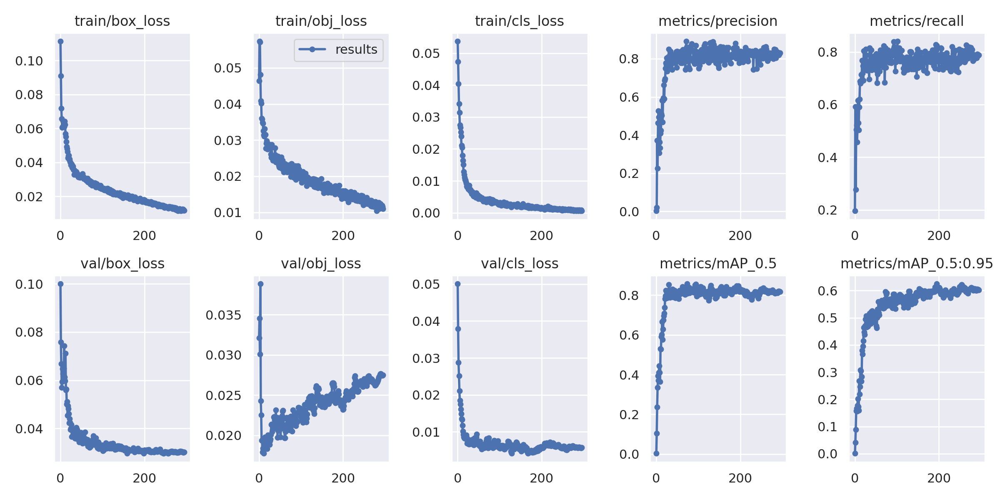

# Traffic Identifier

## Projeto Final - Modelos Preditivos Conexionistas

### Lucas Cristiano Calixto Dantas

**Projeto:** Traffic Identifier

**Descrição:** 
O projeto de identificação de objetos em imagens tem como objetivo criar um modelo capaz de identificar os diferentes tipos de veículos presentes nas imagens capturadas por câmeras no trânsito. As categorias de veículos podem incluir carros, caminhões, ônibus, motocicletas, bicicletas e pedestres.

Para realização do projeto foi realizada a coleta de um grande conjunto de dados para treinamento e teste do modelo, realizando a rotulação das imagens dos diferentes tipos de meios de transporte via Roboflow, realizando pré-processamento desses dados, redimensionando as imagens e normalizando os valores de pixel.

|**Tipo de Projeto**|**Modelo Selecionado**|**Linguagem**|
|--|--|--|
|Deteção de Objetos|YOLOv5|PyTorch|


## Performance

O modelo treinado possui performance de **80.15%** (precision).

### Output do bloco de treinamento  

<details>
    <summary>Clique para expandir.</summary>

    ```text
    wandb: WARNING ⚠️ wandb is deprecated and will be removed in a future release. See supported integrations at https://github.com/ultralytics/yolov5#integrations.
    wandb: Currently logged in as: lucascriistiano. Use `wandb login --relogin` to force relogin
    train: weights=yolov5m.pt, cfg=, data=/content/yolov5/Traffic-Identifier-2/data.yaml, hyp=data/hyps/hyp.scratch-low.yaml, epochs=300, batch_size=32, imgsz=640, rect=False, resume=False, nosave=False, noval=False, noautoanchor=False, noplots=False, evolve=None, bucket=, cache=ram, image_weights=False, device=, multi_scale=False, single_cls=False, optimizer=SGD, sync_bn=False, workers=8, project=runs/train, name=exp, exist_ok=False, quad=False, cos_lr=False, label_smoothing=0.0, patience=100, freeze=[0], save_period=-1, seed=0, local_rank=-1, entity=None, upload_dataset=False, bbox_interval=-1, artifact_alias=latest
    github: up to date with https://github.com/ultralytics/yolov5 ✅
    requirements: /content/requirements.txt not found, check failed.
    YOLOv5 🚀 v7.0-162-gc3e4e94 Python-3.10.11 torch-2.0.0+cu118 CUDA:0 (Tesla T4, 15102MiB)

    hyperparameters: lr0=0.01, lrf=0.01, momentum=0.937, weight_decay=0.0005, warmup_epochs=3.0, warmup_momentum=0.8, warmup_bias_lr=0.1, box=0.05, cls=0.5, cls_pw=1.0, obj=1.0, obj_pw=1.0, iou_t=0.2, anchor_t=4.0, fl_gamma=0.0, hsv_h=0.015, hsv_s=0.7, hsv_v=0.4, degrees=0.0, translate=0.1, scale=0.5, shear=0.0, perspective=0.0, flipud=0.0, fliplr=0.5, mosaic=1.0, mixup=0.0, copy_paste=0.0
    ClearML: run 'pip install clearml' to automatically track, visualize and remotely train YOLOv5 🚀 in ClearML
    Comet: run 'pip install comet_ml' to automatically track and visualize YOLOv5 🚀 runs in Comet
    TensorBoard: Start with 'tensorboard --logdir runs/train', view at http://localhost:6006/
    wandb: Tracking run with wandb version 0.15.2
    wandb: Run data is saved locally in /content/yolov5/wandb/run-20230507_204151-b57jr6l2
    wandb: Run `wandb offline` to turn off syncing.
    wandb: Syncing run fresh-cherry-13
    wandb: ⭐️ View project at https://wandb.ai/lucascriistiano/YOLOv5
    wandb: 🚀 View run at https://wandb.ai/lucascriistiano/YOLOv5/runs/b57jr6l2
    Downloading https://ultralytics.com/assets/Arial.ttf to /root/.config/Ultralytics/Arial.ttf...
    100% 755k/755k [00:00<00:00, 47.4MB/s]
    Downloading https://github.com/ultralytics/yolov5/releases/download/v7.0/yolov5m.pt to yolov5m.pt...
    100% 40.8M/40.8M [00:01<00:00, 41.5MB/s]

    Overriding model.yaml nc=80 with nc=6

                    from  n    params  module                                  arguments                     
    0                -1  1      5280  models.common.Conv                      [3, 48, 6, 2, 2]              
    1                -1  1     41664  models.common.Conv                      [48, 96, 3, 2]                
    2                -1  2     65280  models.common.C3                        [96, 96, 2]                   
    3                -1  1    166272  models.common.Conv                      [96, 192, 3, 2]               
    4                -1  4    444672  models.common.C3                        [192, 192, 4]                 
    5                -1  1    664320  models.common.Conv                      [192, 384, 3, 2]              
    6                -1  6   2512896  models.common.C3                        [384, 384, 6]                 
    7                -1  1   2655744  models.common.Conv                      [384, 768, 3, 2]              
    8                -1  2   4134912  models.common.C3                        [768, 768, 2]                 
    9                -1  1   1476864  models.common.SPPF                      [768, 768, 5]                 
    10                -1  1    295680  models.common.Conv                      [768, 384, 1, 1]              
    11                -1  1         0  torch.nn.modules.upsampling.Upsample    [None, 2, 'nearest']          
    12           [-1, 6]  1         0  models.common.Concat                    [1]                           
    13                -1  2   1182720  models.common.C3                        [768, 384, 2, False]          
    14                -1  1     74112  models.common.Conv                      [384, 192, 1, 1]              
    15                -1  1         0  torch.nn.modules.upsampling.Upsample    [None, 2, 'nearest']          
    16           [-1, 4]  1         0  models.common.Concat                    [1]                           
    17                -1  2    296448  models.common.C3                        [384, 192, 2, False]          
    18                -1  1    332160  models.common.Conv                      [192, 192, 3, 2]              
    19          [-1, 14]  1         0  models.common.Concat                    [1]                           
    20                -1  2   1035264  models.common.C3                        [384, 384, 2, False]          
    21                -1  1   1327872  models.common.Conv                      [384, 384, 3, 2]              
    22          [-1, 10]  1         0  models.common.Concat                    [1]                           
    23                -1  2   4134912  models.common.C3                        [768, 768, 2, False]          
    24      [17, 20, 23]  1     44451  models.yolo.Detect                      [6, [[10, 13, 16, 30, 33, 23], [30, 61, 62, 45, 59, 119], [116, 90, 156, 198, 373, 326]], [192, 384, 768]]
    Model summary: 291 layers, 20891523 parameters, 20891523 gradients, 48.3 GFLOPs

    Transferred 475/481 items from yolov5m.pt
    AMP: checks passed ✅
    optimizer: SGD(lr=0.01) with parameter groups 79 weight(decay=0.0), 82 weight(decay=0.0005), 82 bias
    albumentations: Blur(p=0.01, blur_limit=(3, 7)), MedianBlur(p=0.01, blur_limit=(3, 7)), ToGray(p=0.01), CLAHE(p=0.01, clip_limit=(1, 4.0), tile_grid_size=(8, 8))
    train: Scanning /content/yolov5/Traffic-Identifier-2/train/labels... 267 images, 0 backgrounds, 0 corrupt: 100% 267/267 [00:00<00:00, 578.25it/s]
    train: New cache created: /content/yolov5/Traffic-Identifier-2/train/labels.cache
    train: Caching images (0.3GB ram): 100% 267/267 [00:02<00:00, 114.19it/s]
    val: Scanning /content/yolov5/Traffic-Identifier-2/valid/labels... 74 images, 0 backgrounds, 0 corrupt: 100% 74/74 [00:00<00:00, 307.85it/s]
    val: New cache created: /content/yolov5/Traffic-Identifier-2/valid/labels.cache
    val: Caching images (0.1GB ram): 100% 74/74 [00:01<00:00, 43.42it/s]

    AutoAnchor: 4.74 anchors/target, 1.000 Best Possible Recall (BPR). Current anchors are a good fit to dataset ✅
    Plotting labels to runs/train/exp/labels.jpg... 
    Image sizes 640 train, 640 val
    Using 2 dataloader workers
    Logging results to runs/train/exp
    Starting training for 300 epochs...

        Epoch    GPU_mem   box_loss   obj_loss   cls_loss  Instances       Size
        0/299      11.9G     0.1113    0.04639    0.05373         87        640: 100% 9/9 [00:14<00:00,  1.61s/it]
                    Class     Images  Instances          P          R      mAP50   mAP50-95: 100% 2/2 [00:02<00:00,  1.31s/it]
                    all         74        276     0.0027      0.196    0.00304   0.000925

        Epoch    GPU_mem   box_loss   obj_loss   cls_loss  Instances       Size
        1/299      14.3G    0.09086    0.05736    0.04739         67        640: 100% 9/9 [00:07<00:00,  1.28it/s]
                    Class     Images  Instances          P          R      mAP50   mAP50-95: 100% 2/2 [00:01<00:00,  1.05it/s]
                    all         74        276     0.0213      0.592      0.104     0.0404

        Epoch    GPU_mem   box_loss   obj_loss   cls_loss  Instances       Size
        2/299      14.3G    0.07177    0.05711    0.04038         66        640: 100% 9/9 [00:05<00:00,  1.52it/s]
                    Class     Images  Instances          P          R      mAP50   mAP50-95: 100% 2/2 [00:01<00:00,  1.42it/s]
                    all         74        276      0.372      0.277      0.236     0.0886

        Epoch    GPU_mem   box_loss   obj_loss   cls_loss  Instances       Size
        3/299      14.3G    0.06561    0.04812    0.03417         77        640: 100% 9/9 [00:06<00:00,  1.29it/s]
                    Class     Images  Instances          P          R      mAP50   mAP50-95: 100% 2/2 [00:01<00:00,  1.24it/s]
                    all         74        276      0.226      0.505      0.335      0.157

        Epoch    GPU_mem   box_loss   obj_loss   cls_loss  Instances       Size
        4/299      14.3G    0.06048    0.04089    0.03143         71        640: 100% 9/9 [00:05<00:00,  1.50it/s]
                    Class     Images  Instances          P          R      mAP50   mAP50-95: 100% 2/2 [00:01<00:00,  1.54it/s]
                    all         74        276      0.463      0.522      0.394      0.166

        Epoch    GPU_mem   box_loss   obj_loss   cls_loss  Instances       Size
        5/299      14.3G    0.06098    0.04022    0.02748         69        640: 100% 9/9 [00:06<00:00,  1.33it/s]
                    Class     Images  Instances          P          R      mAP50   mAP50-95: 100% 2/2 [00:01<00:00,  1.62it/s]
                    all         74        276      0.526      0.458       0.37      0.156

        Epoch    GPU_mem   box_loss   obj_loss   cls_loss  Instances       Size
        6/299      14.3G    0.06445    0.03603    0.02675         75        640: 100% 9/9 [00:05<00:00,  1.53it/s]
                    Class     Images  Instances          P          R      mAP50   mAP50-95: 100% 2/2 [00:01<00:00,  1.45it/s]
                    all         74        276      0.494      0.503       0.41      0.178

        Epoch    GPU_mem   box_loss   obj_loss   cls_loss  Instances       Size
        7/299      14.3G    0.06177    0.03577    0.02533         59        640: 100% 9/9 [00:06<00:00,  1.39it/s]
                    Class     Images  Instances          P          R      mAP50   mAP50-95: 100% 2/2 [00:01<00:00,  1.66it/s]
                    all         74        276      0.307      0.616      0.444      0.202

        Epoch    GPU_mem   box_loss   obj_loss   cls_loss  Instances       Size
        8/299      14.3G    0.06381    0.03481    0.02393         77        640: 100% 9/9 [00:05<00:00,  1.53it/s]
                    Class     Images  Instances          P          R      mAP50   mAP50-95: 100% 2/2 [00:01<00:00,  1.17it/s]
                    all         74        276      0.364       0.53      0.411      0.173

        Epoch    GPU_mem   box_loss   obj_loss   cls_loss  Instances       Size
        9/299      14.3G    0.06094    0.03463     0.0211         84        640: 100% 9/9 [00:06<00:00,  1.39it/s]
                    Class     Images  Instances          P          R      mAP50   mAP50-95: 100% 2/2 [00:01<00:00,  1.68it/s]
                    all         74        276      0.332      0.504      0.363      0.159

        Epoch    GPU_mem   box_loss   obj_loss   cls_loss  Instances       Size
        10/299      14.3G    0.06418    0.03255    0.02047         75        640: 100% 9/9 [00:05<00:00,  1.52it/s]
                    Class     Images  Instances          P          R      mAP50   mAP50-95: 100% 2/2 [00:01<00:00,  1.28it/s]
                    all         74        276       0.41      0.591       0.53      0.268

        Epoch    GPU_mem   box_loss   obj_loss   cls_loss  Instances       Size
        11/299      14.3G    0.06216    0.03145    0.01793         67        640: 100% 9/9 [00:06<00:00,  1.38it/s]
                    Class     Images  Instances          P          R      mAP50   mAP50-95: 100% 2/2 [00:01<00:00,  1.69it/s]
                    all         74        276      0.424      0.621      0.529      0.219

        Epoch    GPU_mem   box_loss   obj_loss   cls_loss  Instances       Size
        12/299      14.3G    0.05685    0.03106    0.01645         77        640: 100% 9/9 [00:06<00:00,  1.49it/s]
                    Class     Images  Instances          P          R      mAP50   mAP50-95: 100% 2/2 [00:01<00:00,  1.14it/s]
                    all         74        276      0.513      0.688      0.592      0.247

        Epoch    GPU_mem   box_loss   obj_loss   cls_loss  Instances       Size
        13/299      14.3G    0.05505    0.03318    0.01508         83        640: 100% 9/9 [00:06<00:00,  1.41it/s]
                    Class     Images  Instances          P          R      mAP50   mAP50-95: 100% 2/2 [00:01<00:00,  1.63it/s]
                    all         74        276      0.504      0.681      0.602      0.307

        Epoch    GPU_mem   box_loss   obj_loss   cls_loss  Instances       Size
        14/299      14.3G    0.05231    0.03138    0.01287         74        640: 100% 9/9 [00:06<00:00,  1.44it/s]
                    Class     Images  Instances          P          R      mAP50   mAP50-95: 100% 2/2 [00:01<00:00,  1.01it/s]
                    all         74        276      0.582      0.691      0.667      0.305

        Epoch    GPU_mem   box_loss   obj_loss   cls_loss  Instances       Size
        15/299      14.3G    0.04919    0.03153    0.01198         77        640: 100% 9/9 [00:06<00:00,  1.44it/s]
                    Class     Images  Instances          P          R      mAP50   mAP50-95: 100% 2/2 [00:01<00:00,  1.64it/s]
                    all         74        276      0.468      0.713      0.577      0.266

        Epoch    GPU_mem   box_loss   obj_loss   cls_loss  Instances       Size
        16/299      14.3G    0.04808    0.02774    0.01109         61        640: 100% 9/9 [00:06<00:00,  1.40it/s]
                    Class     Images  Instances          P          R      mAP50   mAP50-95: 100% 2/2 [00:02<00:00,  1.09s/it]
                    all         74        276      0.582      0.689      0.628      0.283

        Epoch    GPU_mem   box_loss   obj_loss   cls_loss  Instances       Size
        17/299      14.3G     0.0463    0.02907    0.01036         75        640: 100% 9/9 [00:06<00:00,  1.48it/s]
                    Class     Images  Instances          P          R      mAP50   mAP50-95: 100% 2/2 [00:01<00:00,  1.66it/s]
                    all         74        276      0.594      0.768      0.676       0.38

        Epoch    GPU_mem   box_loss   obj_loss   cls_loss  Instances       Size
        18/299      14.3G    0.04276    0.02982    0.01032         81        640: 100% 9/9 [00:06<00:00,  1.35it/s]
                    Class     Images  Instances          P          R      mAP50   mAP50-95: 100% 2/2 [00:01<00:00,  1.01it/s]
                    all         74        276      0.663      0.718      0.695      0.367

        Epoch    GPU_mem   box_loss   obj_loss   cls_loss  Instances       Size
        19/299      14.3G    0.04399    0.02918   0.009711         83        640: 100% 9/9 [00:06<00:00,  1.48it/s]
                    Class     Images  Instances          P          R      mAP50   mAP50-95: 100% 2/2 [00:01<00:00,  1.68it/s]
                    all         74        276       0.59      0.747      0.709      0.395

        Epoch    GPU_mem   box_loss   obj_loss   cls_loss  Instances       Size
        20/299      14.3G    0.04403    0.02747   0.009243         65        640: 100% 9/9 [00:06<00:00,  1.36it/s]
                    Class     Images  Instances          P          R      mAP50   mAP50-95: 100% 2/2 [00:01<00:00,  1.08it/s]
                    all         74        276      0.687      0.692      0.739      0.415

        Epoch    GPU_mem   box_loss   obj_loss   cls_loss  Instances       Size
        21/299      14.3G     0.0417    0.02774   0.008292         86        640: 100% 9/9 [00:06<00:00,  1.49it/s]
                    Class     Images  Instances          P          R      mAP50   mAP50-95: 100% 2/2 [00:01<00:00,  1.66it/s]
                    all         74        276      0.695      0.804      0.782      0.464

        Epoch    GPU_mem   box_loss   obj_loss   cls_loss  Instances       Size
        22/299      14.3G    0.04187    0.02797   0.008103         75        640: 100% 9/9 [00:06<00:00,  1.32it/s]
                    Class     Images  Instances          P          R      mAP50   mAP50-95: 100% 2/2 [00:01<00:00,  1.39it/s]
                    all         74        276       0.75      0.745      0.797      0.447

        Epoch    GPU_mem   box_loss   obj_loss   cls_loss  Instances       Size
        23/299      14.3G    0.04044    0.02884   0.008363         68        640: 100% 9/9 [00:06<00:00,  1.48it/s]
                    Class     Images  Instances          P          R      mAP50   mAP50-95: 100% 2/2 [00:01<00:00,  1.65it/s]
                    all         74        276      0.777      0.765      0.824      0.438

        Epoch    GPU_mem   box_loss   obj_loss   cls_loss  Instances       Size
        24/299      14.3G    0.03999    0.02831   0.007958         79        640: 100% 9/9 [00:06<00:00,  1.37it/s]
                    Class     Images  Instances          P          R      mAP50   mAP50-95: 100% 2/2 [00:01<00:00,  1.05it/s]
                    all         74        276      0.768      0.775      0.821       0.47

        Epoch    GPU_mem   box_loss   obj_loss   cls_loss  Instances       Size
        25/299      14.3G    0.03841    0.02873   0.007407         69        640: 100% 9/9 [00:06<00:00,  1.48it/s]
                    Class     Images  Instances          P          R      mAP50   mAP50-95: 100% 2/2 [00:01<00:00,  1.64it/s]
                    all         74        276      0.805      0.743      0.816      0.495

        Epoch    GPU_mem   box_loss   obj_loss   cls_loss  Instances       Size
        26/299      14.3G    0.03855    0.02799    0.00749         77        640: 100% 9/9 [00:06<00:00,  1.31it/s]
                    Class     Images  Instances          P          R      mAP50   mAP50-95: 100% 2/2 [00:01<00:00,  1.35it/s]
                    all         74        276      0.735       0.81      0.787      0.469

        Epoch    GPU_mem   box_loss   obj_loss   cls_loss  Instances       Size
        27/299      14.3G    0.03891    0.02826   0.008538         76        640: 100% 9/9 [00:06<00:00,  1.48it/s]
                    Class     Images  Instances          P          R      mAP50   mAP50-95: 100% 2/2 [00:01<00:00,  1.66it/s]
                    all         74        276      0.768      0.788      0.813      0.507

        Epoch    GPU_mem   box_loss   obj_loss   cls_loss  Instances       Size
        28/299      14.3G    0.03704    0.02605   0.007302         58        640: 100% 9/9 [00:06<00:00,  1.30it/s]
                    Class     Images  Instances          P          R      mAP50   mAP50-95: 100% 2/2 [00:01<00:00,  1.55it/s]
                    all         74        276      0.759      0.748      0.799      0.466

        Epoch    GPU_mem   box_loss   obj_loss   cls_loss  Instances       Size
        29/299      14.3G    0.03694    0.02523   0.006875         77        640: 100% 9/9 [00:06<00:00,  1.47it/s]
                    Class     Images  Instances          P          R      mAP50   mAP50-95: 100% 2/2 [00:01<00:00,  1.63it/s]
                    all         74        276      0.811       0.73      0.806      0.496

        Epoch    GPU_mem   box_loss   obj_loss   cls_loss  Instances       Size
        30/299      14.3G    0.03769    0.02876   0.007277         96        640: 100% 9/9 [00:06<00:00,  1.30it/s]
                    Class     Images  Instances          P          R      mAP50   mAP50-95: 100% 2/2 [00:01<00:00,  1.23it/s]
                    all         74        276      0.849      0.763      0.854      0.503

        Epoch    GPU_mem   box_loss   obj_loss   cls_loss  Instances       Size
        31/299      14.3G    0.03578    0.02558   0.007072         72        640: 100% 9/9 [00:06<00:00,  1.46it/s]
                    Class     Images  Instances          P          R      mAP50   mAP50-95: 100% 2/2 [00:01<00:00,  1.64it/s]
                    all         74        276      0.778      0.762      0.827      0.468

        Epoch    GPU_mem   box_loss   obj_loss   cls_loss  Instances       Size
        32/299      14.3G    0.03573      0.025    0.00655         81        640: 100% 9/9 [00:07<00:00,  1.28it/s]
                    Class     Images  Instances          P          R      mAP50   mAP50-95: 100% 2/2 [00:01<00:00,  1.31it/s]
                    all         74        276      0.813       0.76      0.818      0.477

        Epoch    GPU_mem   box_loss   obj_loss   cls_loss  Instances       Size
        33/299      14.3G    0.03279    0.02436   0.005994         66        640: 100% 9/9 [00:06<00:00,  1.46it/s]
                    Class     Images  Instances          P          R      mAP50   mAP50-95: 100% 2/2 [00:01<00:00,  1.67it/s]
                    all         74        276      0.767      0.735      0.787      0.487

        Epoch    GPU_mem   box_loss   obj_loss   cls_loss  Instances       Size
        34/299      14.3G    0.03524    0.02528   0.006589         69        640: 100% 9/9 [00:06<00:00,  1.30it/s]
                    Class     Images  Instances          P          R      mAP50   mAP50-95: 100% 2/2 [00:01<00:00,  1.31it/s]
                    all         74        276      0.839      0.697      0.814      0.511

        Epoch    GPU_mem   box_loss   obj_loss   cls_loss  Instances       Size
        35/299      14.3G    0.03433    0.02568    0.00654         60        640: 100% 9/9 [00:06<00:00,  1.46it/s]
                    Class     Images  Instances          P          R      mAP50   mAP50-95: 100% 2/2 [00:01<00:00,  1.66it/s]
                    all         74        276      0.784      0.815      0.806      0.516

        Epoch    GPU_mem   box_loss   obj_loss   cls_loss  Instances       Size
        36/299      14.3G    0.03461    0.02473   0.005842         41        640: 100% 9/9 [00:06<00:00,  1.32it/s]
                    Class     Images  Instances          P          R      mAP50   mAP50-95: 100% 2/2 [00:01<00:00,  1.64it/s]
                    all         74        276      0.815       0.76      0.824      0.513

        Epoch    GPU_mem   box_loss   obj_loss   cls_loss  Instances       Size
        37/299      14.3G    0.03439    0.02516   0.005338         70        640: 100% 9/9 [00:06<00:00,  1.46it/s]
                    Class     Images  Instances          P          R      mAP50   mAP50-95: 100% 2/2 [00:01<00:00,  1.49it/s]
                    all         74        276      0.815      0.766      0.823      0.477

        Epoch    GPU_mem   box_loss   obj_loss   cls_loss  Instances       Size
        38/299      14.3G    0.03455    0.02785   0.005169         87        640: 100% 9/9 [00:06<00:00,  1.32it/s]
                    Class     Images  Instances          P          R      mAP50   mAP50-95: 100% 2/2 [00:01<00:00,  1.62it/s]
                    all         74        276      0.743      0.766      0.792      0.479

        Epoch    GPU_mem   box_loss   obj_loss   cls_loss  Instances       Size
        39/299      14.3G    0.03344    0.02586   0.005629         60        640: 100% 9/9 [00:06<00:00,  1.44it/s]
                    Class     Images  Instances          P          R      mAP50   mAP50-95: 100% 2/2 [00:01<00:00,  1.41it/s]
                    all         74        276      0.804      0.807      0.831      0.522

        Epoch    GPU_mem   box_loss   obj_loss   cls_loss  Instances       Size
        40/299      14.3G    0.03362    0.02393   0.005446         54        640: 100% 9/9 [00:06<00:00,  1.34it/s]
                    Class     Images  Instances          P          R      mAP50   mAP50-95: 100% 2/2 [00:01<00:00,  1.65it/s]
                    all         74        276      0.817      0.731      0.791      0.497

        Epoch    GPU_mem   box_loss   obj_loss   cls_loss  Instances       Size
        41/299      14.3G    0.03201    0.02517   0.005197         52        640: 100% 9/9 [00:06<00:00,  1.44it/s]
                    Class     Images  Instances          P          R      mAP50   mAP50-95: 100% 2/2 [00:01<00:00,  1.38it/s]
                    all         74        276      0.778      0.763      0.797      0.526

        Epoch    GPU_mem   box_loss   obj_loss   cls_loss  Instances       Size
        42/299      14.3G    0.03296    0.02441   0.006077         82        640: 100% 9/9 [00:06<00:00,  1.38it/s]
                    Class     Images  Instances          P          R      mAP50   mAP50-95: 100% 2/2 [00:01<00:00,  1.60it/s]
                    all         74        276      0.807      0.745      0.803      0.501

        Epoch    GPU_mem   box_loss   obj_loss   cls_loss  Instances       Size
        43/299      14.3G    0.03138      0.025   0.004846         78        640: 100% 9/9 [00:06<00:00,  1.42it/s]
                    Class     Images  Instances          P          R      mAP50   mAP50-95: 100% 2/2 [00:01<00:00,  1.08it/s]
                    all         74        276      0.814      0.744      0.802      0.513

        Epoch    GPU_mem   box_loss   obj_loss   cls_loss  Instances       Size
        44/299      14.3G    0.03141    0.02454   0.006265         88        640: 100% 9/9 [00:06<00:00,  1.40it/s]
                    Class     Images  Instances          P          R      mAP50   mAP50-95: 100% 2/2 [00:01<00:00,  1.62it/s]
                    all         74        276      0.822      0.754      0.823      0.513

        Epoch    GPU_mem   box_loss   obj_loss   cls_loss  Instances       Size
        45/299      14.3G    0.03161    0.02554   0.005462         55        640: 100% 9/9 [00:06<00:00,  1.39it/s]
                    Class     Images  Instances          P          R      mAP50   mAP50-95: 100% 2/2 [00:01<00:00,  1.07it/s]
                    all         74        276      0.777      0.742      0.785      0.493

        Epoch    GPU_mem   box_loss   obj_loss   cls_loss  Instances       Size
        46/299      14.3G    0.03208    0.02407   0.005493         58        640: 100% 9/9 [00:06<00:00,  1.41it/s]
                    Class     Images  Instances          P          R      mAP50   mAP50-95: 100% 2/2 [00:01<00:00,  1.65it/s]
                    all         74        276      0.788      0.784      0.811      0.485

        Epoch    GPU_mem   box_loss   obj_loss   cls_loss  Instances       Size
        47/299      14.3G    0.03117    0.02294    0.00527         77        640: 100% 9/9 [00:06<00:00,  1.35it/s]
                    Class     Images  Instances          P          R      mAP50   mAP50-95: 100% 2/2 [00:01<00:00,  1.06it/s]
                    all         74        276      0.837       0.75      0.813      0.511

        Epoch    GPU_mem   box_loss   obj_loss   cls_loss  Instances       Size
        48/299      14.3G    0.03259    0.02251   0.005515         67        640: 100% 9/9 [00:06<00:00,  1.43it/s]
                    Class     Images  Instances          P          R      mAP50   mAP50-95: 100% 2/2 [00:01<00:00,  1.63it/s]
                    all         74        276      0.755      0.786       0.79      0.492

        Epoch    GPU_mem   box_loss   obj_loss   cls_loss  Instances       Size
        49/299      14.3G     0.0321    0.02246   0.004375         58        640: 100% 9/9 [00:06<00:00,  1.32it/s]
                    Class     Images  Instances          P          R      mAP50   mAP50-95: 100% 2/2 [00:02<00:00,  1.00s/it]
                    all         74        276      0.838      0.766      0.803      0.514

        Epoch    GPU_mem   box_loss   obj_loss   cls_loss  Instances       Size
        50/299      14.3G    0.03194    0.02423   0.004575         75        640: 100% 9/9 [00:06<00:00,  1.44it/s]
                    Class     Images  Instances          P          R      mAP50   mAP50-95: 100% 2/2 [00:01<00:00,  1.62it/s]
                    all         74        276      0.824      0.749      0.801       0.52

        Epoch    GPU_mem   box_loss   obj_loss   cls_loss  Instances       Size
        51/299      14.3G    0.03155    0.02489   0.004924         70        640: 100% 9/9 [00:06<00:00,  1.31it/s]
                    Class     Images  Instances          P          R      mAP50   mAP50-95: 100% 2/2 [00:01<00:00,  1.08it/s]
                    all         74        276      0.813      0.793      0.808       0.47

        Epoch    GPU_mem   box_loss   obj_loss   cls_loss  Instances       Size
        52/299      14.3G    0.03321    0.02441    0.00476         81        640: 100% 9/9 [00:06<00:00,  1.43it/s]
                    Class     Images  Instances          P          R      mAP50   mAP50-95: 100% 2/2 [00:01<00:00,  1.61it/s]
                    all         74        276      0.823      0.729      0.798      0.463

        Epoch    GPU_mem   box_loss   obj_loss   cls_loss  Instances       Size
        53/299      14.3G    0.03171    0.02527   0.005104         78        640: 100% 9/9 [00:07<00:00,  1.28it/s]
                    Class     Images  Instances          P          R      mAP50   mAP50-95: 100% 2/2 [00:01<00:00,  1.32it/s]
                    all         74        276      0.824      0.683      0.781      0.502

        Epoch    GPU_mem   box_loss   obj_loss   cls_loss  Instances       Size
        54/299      14.3G     0.0317    0.02439    0.00472         87        640: 100% 9/9 [00:06<00:00,  1.45it/s]
                    Class     Images  Instances          P          R      mAP50   mAP50-95: 100% 2/2 [00:01<00:00,  1.63it/s]
                    all         74        276      0.834      0.716      0.814      0.532

        Epoch    GPU_mem   box_loss   obj_loss   cls_loss  Instances       Size
        55/299      14.3G    0.03036    0.02211   0.004681         62        640: 100% 9/9 [00:07<00:00,  1.28it/s]
                    Class     Images  Instances          P          R      mAP50   mAP50-95: 100% 2/2 [00:01<00:00,  1.48it/s]
                    all         74        276      0.794      0.783      0.825      0.508

        Epoch    GPU_mem   box_loss   obj_loss   cls_loss  Instances       Size
        56/299      14.3G    0.03115    0.02433   0.004323        112        640: 100% 9/9 [00:06<00:00,  1.45it/s]
                    Class     Images  Instances          P          R      mAP50   mAP50-95: 100% 2/2 [00:01<00:00,  1.60it/s]
                    all         74        276      0.795      0.784      0.825      0.559

        Epoch    GPU_mem   box_loss   obj_loss   cls_loss  Instances       Size
        57/299      14.3G    0.03083    0.02244   0.004709         74        640: 100% 9/9 [00:07<00:00,  1.26it/s]
                    Class     Images  Instances          P          R      mAP50   mAP50-95: 100% 2/2 [00:01<00:00,  1.51it/s]
                    all         74        276      0.812       0.76       0.82      0.518

        Epoch    GPU_mem   box_loss   obj_loss   cls_loss  Instances       Size
        58/299      14.3G    0.03058    0.02253    0.00471         68        640: 100% 9/9 [00:06<00:00,  1.45it/s]
                    Class     Images  Instances          P          R      mAP50   mAP50-95: 100% 2/2 [00:01<00:00,  1.63it/s]
                    all         74        276      0.778      0.779      0.808       0.51

        Epoch    GPU_mem   box_loss   obj_loss   cls_loss  Instances       Size
        59/299      14.3G    0.03032    0.02113   0.004245         78        640: 100% 9/9 [00:06<00:00,  1.29it/s]
                    Class     Images  Instances          P          R      mAP50   mAP50-95: 100% 2/2 [00:01<00:00,  1.48it/s]
                    all         74        276      0.839      0.726      0.814      0.535

        Epoch    GPU_mem   box_loss   obj_loss   cls_loss  Instances       Size
        60/299      14.3G    0.02973     0.0231   0.004028         61        640: 100% 9/9 [00:06<00:00,  1.44it/s]
                    Class     Images  Instances          P          R      mAP50   mAP50-95: 100% 2/2 [00:01<00:00,  1.63it/s]
                    all         74        276      0.786      0.797      0.818      0.538

        Epoch    GPU_mem   box_loss   obj_loss   cls_loss  Instances       Size
        61/299      14.3G    0.02954    0.02321   0.003651         60        640: 100% 9/9 [00:07<00:00,  1.26it/s]
                    Class     Images  Instances          P          R      mAP50   mAP50-95: 100% 2/2 [00:01<00:00,  1.61it/s]
                    all         74        276      0.777      0.807      0.826      0.542

        Epoch    GPU_mem   box_loss   obj_loss   cls_loss  Instances       Size
        62/299      14.3G    0.02923    0.02349   0.003976         73        640: 100% 9/9 [00:06<00:00,  1.43it/s]
                    Class     Images  Instances          P          R      mAP50   mAP50-95: 100% 2/2 [00:01<00:00,  1.51it/s]
                    all         74        276      0.803      0.792      0.843      0.553

        Epoch    GPU_mem   box_loss   obj_loss   cls_loss  Instances       Size
        63/299      14.3G    0.02991     0.0227   0.004056         64        640: 100% 9/9 [00:06<00:00,  1.29it/s]
                    Class     Images  Instances          P          R      mAP50   mAP50-95: 100% 2/2 [00:01<00:00,  1.60it/s]
                    all         74        276      0.847      0.776      0.841      0.558

        Epoch    GPU_mem   box_loss   obj_loss   cls_loss  Instances       Size
        64/299      14.3G    0.03067    0.02273   0.003776         80        640: 100% 9/9 [00:06<00:00,  1.44it/s]
                    Class     Images  Instances          P          R      mAP50   mAP50-95: 100% 2/2 [00:01<00:00,  1.40it/s]
                    all         74        276      0.817      0.776      0.828      0.564

        Epoch    GPU_mem   box_loss   obj_loss   cls_loss  Instances       Size
        65/299      14.3G    0.02842    0.02167   0.004073         85        640: 100% 9/9 [00:06<00:00,  1.34it/s]
                    Class     Images  Instances          P          R      mAP50   mAP50-95: 100% 2/2 [00:01<00:00,  1.63it/s]
                    all         74        276      0.792      0.765       0.82      0.561

        Epoch    GPU_mem   box_loss   obj_loss   cls_loss  Instances       Size
        66/299      14.3G    0.02907    0.02128   0.004293         68        640: 100% 9/9 [00:06<00:00,  1.44it/s]
                    Class     Images  Instances          P          R      mAP50   mAP50-95: 100% 2/2 [00:01<00:00,  1.20it/s]
                    all         74        276      0.829      0.754       0.82      0.563

        Epoch    GPU_mem   box_loss   obj_loss   cls_loss  Instances       Size
        67/299      14.3G    0.02885     0.0212   0.003889         79        640: 100% 9/9 [00:06<00:00,  1.36it/s]
                    Class     Images  Instances          P          R      mAP50   mAP50-95: 100% 2/2 [00:01<00:00,  1.64it/s]
                    all         74        276      0.811      0.784      0.838      0.548

        Epoch    GPU_mem   box_loss   obj_loss   cls_loss  Instances       Size
        68/299      14.3G    0.02947    0.02206   0.003364         89        640: 100% 9/9 [00:06<00:00,  1.39it/s]
                    Class     Images  Instances          P          R      mAP50   mAP50-95: 100% 2/2 [00:01<00:00,  1.13it/s]
                    all         74        276       0.81      0.742      0.802      0.535

        Epoch    GPU_mem   box_loss   obj_loss   cls_loss  Instances       Size
        69/299      14.3G      0.028    0.02312   0.003498         75        640: 100% 9/9 [00:06<00:00,  1.37it/s]
                    Class     Images  Instances          P          R      mAP50   mAP50-95: 100% 2/2 [00:01<00:00,  1.63it/s]
                    all         74        276      0.743      0.823      0.827       0.54

        Epoch    GPU_mem   box_loss   obj_loss   cls_loss  Instances       Size
        70/299      14.3G    0.02914    0.02126   0.004299         54        640: 100% 9/9 [00:06<00:00,  1.38it/s]
                    Class     Images  Instances          P          R      mAP50   mAP50-95: 100% 2/2 [00:01<00:00,  1.12it/s]
                    all         74        276      0.787      0.772      0.826      0.537

        Epoch    GPU_mem   box_loss   obj_loss   cls_loss  Instances       Size
        71/299      14.3G    0.02726    0.02156   0.004211         58        640: 100% 9/9 [00:06<00:00,  1.38it/s]
                    Class     Images  Instances          P          R      mAP50   mAP50-95: 100% 2/2 [00:01<00:00,  1.64it/s]
                    all         74        276      0.891      0.684      0.806      0.548

        Epoch    GPU_mem   box_loss   obj_loss   cls_loss  Instances       Size
        72/299      14.3G    0.02786    0.02198   0.004148         63        640: 100% 9/9 [00:06<00:00,  1.36it/s]
                    Class     Images  Instances          P          R      mAP50   mAP50-95: 100% 2/2 [00:01<00:00,  1.04it/s]
                    all         74        276      0.861      0.789      0.841      0.568

        Epoch    GPU_mem   box_loss   obj_loss   cls_loss  Instances       Size
        73/299      14.3G    0.02862     0.0221   0.003837         73        640: 100% 9/9 [00:06<00:00,  1.43it/s]
                    Class     Images  Instances          P          R      mAP50   mAP50-95: 100% 2/2 [00:01<00:00,  1.63it/s]
                    all         74        276      0.832      0.815      0.857      0.596

        Epoch    GPU_mem   box_loss   obj_loss   cls_loss  Instances       Size
        74/299      14.3G    0.02792    0.02116   0.003755         80        640: 100% 9/9 [00:06<00:00,  1.29it/s]
                    Class     Images  Instances          P          R      mAP50   mAP50-95: 100% 2/2 [00:01<00:00,  1.33it/s]
                    all         74        276       0.84       0.74      0.809      0.542

        Epoch    GPU_mem   box_loss   obj_loss   cls_loss  Instances       Size
        75/299      14.3G    0.02652    0.02137    0.00378         56        640: 100% 9/9 [00:06<00:00,  1.43it/s]
                    Class     Images  Instances          P          R      mAP50   mAP50-95: 100% 2/2 [00:01<00:00,  1.62it/s]
                    all         74        276      0.813      0.793      0.826      0.587

        Epoch    GPU_mem   box_loss   obj_loss   cls_loss  Instances       Size
        76/299      14.3G    0.02691    0.01993   0.004468         77        640: 100% 9/9 [00:06<00:00,  1.31it/s]
                    Class     Images  Instances          P          R      mAP50   mAP50-95: 100% 2/2 [00:01<00:00,  1.42it/s]
                    all         74        276      0.795      0.788      0.827      0.592

        Epoch    GPU_mem   box_loss   obj_loss   cls_loss  Instances       Size
        77/299      14.3G    0.02718     0.0235   0.003946         75        640: 100% 9/9 [00:06<00:00,  1.42it/s]
                    Class     Images  Instances          P          R      mAP50   mAP50-95: 100% 2/2 [00:01<00:00,  1.60it/s]
                    all         74        276      0.756      0.794      0.829      0.547

        Epoch    GPU_mem   box_loss   obj_loss   cls_loss  Instances       Size
        78/299      14.3G    0.02763    0.02344   0.003217         96        640: 100% 9/9 [00:06<00:00,  1.29it/s]
                    Class     Images  Instances          P          R      mAP50   mAP50-95: 100% 2/2 [00:01<00:00,  1.31it/s]
                    all         74        276      0.802      0.782      0.838      0.555

        Epoch    GPU_mem   box_loss   obj_loss   cls_loss  Instances       Size
        79/299      14.3G    0.02688    0.02037   0.004165         74        640: 100% 9/9 [00:06<00:00,  1.43it/s]
                    Class     Images  Instances          P          R      mAP50   mAP50-95: 100% 2/2 [00:01<00:00,  1.62it/s]
                    all         74        276      0.746      0.807      0.812      0.545

        Epoch    GPU_mem   box_loss   obj_loss   cls_loss  Instances       Size
        80/299      14.3G    0.02796    0.02193   0.003452         60        640: 100% 9/9 [00:06<00:00,  1.30it/s]
                    Class     Images  Instances          P          R      mAP50   mAP50-95: 100% 2/2 [00:01<00:00,  1.34it/s]
                    all         74        276      0.794      0.772      0.827      0.546

        Epoch    GPU_mem   box_loss   obj_loss   cls_loss  Instances       Size
        81/299      14.3G    0.02682    0.02215   0.002906         76        640: 100% 9/9 [00:06<00:00,  1.43it/s]
                    Class     Images  Instances          P          R      mAP50   mAP50-95: 100% 2/2 [00:01<00:00,  1.65it/s]
                    all         74        276      0.801      0.792      0.822      0.549

        Epoch    GPU_mem   box_loss   obj_loss   cls_loss  Instances       Size
        82/299      14.3G    0.02786    0.02108   0.004167         68        640: 100% 9/9 [00:06<00:00,  1.29it/s]
                    Class     Images  Instances          P          R      mAP50   mAP50-95: 100% 2/2 [00:01<00:00,  1.39it/s]
                    all         74        276      0.867       0.76      0.829      0.564

        Epoch    GPU_mem   box_loss   obj_loss   cls_loss  Instances       Size
        83/299      14.3G    0.02593    0.01959   0.003443         42        640: 100% 9/9 [00:06<00:00,  1.43it/s]
                    Class     Images  Instances          P          R      mAP50   mAP50-95: 100% 2/2 [00:01<00:00,  1.60it/s]
                    all         74        276      0.851      0.797      0.828      0.568

        Epoch    GPU_mem   box_loss   obj_loss   cls_loss  Instances       Size
        84/299      14.3G    0.02539    0.02064   0.003957         54        640: 100% 9/9 [00:06<00:00,  1.31it/s]
                    Class     Images  Instances          P          R      mAP50   mAP50-95: 100% 2/2 [00:01<00:00,  1.26it/s]
                    all         74        276      0.878      0.773      0.825       0.56

        Epoch    GPU_mem   box_loss   obj_loss   cls_loss  Instances       Size
        85/299      14.3G    0.02552    0.02088    0.00353         77        640: 100% 9/9 [00:06<00:00,  1.43it/s]
                    Class     Images  Instances          P          R      mAP50   mAP50-95: 100% 2/2 [00:01<00:00,  1.60it/s]
                    all         74        276      0.842      0.769      0.817      0.556

        Epoch    GPU_mem   box_loss   obj_loss   cls_loss  Instances       Size
        86/299      14.3G    0.02737     0.0217   0.003233         80        640: 100% 9/9 [00:06<00:00,  1.31it/s]
                    Class     Images  Instances          P          R      mAP50   mAP50-95: 100% 2/2 [00:01<00:00,  1.30it/s]
                    all         74        276      0.844      0.758      0.815      0.543

        Epoch    GPU_mem   box_loss   obj_loss   cls_loss  Instances       Size
        87/299      14.3G    0.02642    0.02289   0.003206         64        640: 100% 9/9 [00:06<00:00,  1.43it/s]
                    Class     Images  Instances          P          R      mAP50   mAP50-95: 100% 2/2 [00:01<00:00,  1.62it/s]
                    all         74        276      0.844      0.765      0.832      0.558

        Epoch    GPU_mem   box_loss   obj_loss   cls_loss  Instances       Size
        88/299      14.3G    0.02673    0.01905   0.003416         55        640: 100% 9/9 [00:07<00:00,  1.26it/s]
                    Class     Images  Instances          P          R      mAP50   mAP50-95: 100% 2/2 [00:01<00:00,  1.42it/s]
                    all         74        276      0.799        0.8      0.831      0.571

        Epoch    GPU_mem   box_loss   obj_loss   cls_loss  Instances       Size
        89/299      14.3G    0.02622    0.02022   0.003476         74        640: 100% 9/9 [00:06<00:00,  1.43it/s]
                    Class     Images  Instances          P          R      mAP50   mAP50-95: 100% 2/2 [00:01<00:00,  1.62it/s]
                    all         74        276      0.782      0.792      0.824      0.536

        Epoch    GPU_mem   box_loss   obj_loss   cls_loss  Instances       Size
        90/299      14.3G    0.02654    0.02094   0.003501         86        640: 100% 9/9 [00:07<00:00,  1.28it/s]
                    Class     Images  Instances          P          R      mAP50   mAP50-95: 100% 2/2 [00:01<00:00,  1.34it/s]
                    all         74        276      0.781      0.787      0.813      0.557

        Epoch    GPU_mem   box_loss   obj_loss   cls_loss  Instances       Size
        91/299      14.3G    0.02588    0.02101   0.003464         72        640: 100% 9/9 [00:06<00:00,  1.43it/s]
                    Class     Images  Instances          P          R      mAP50   mAP50-95: 100% 2/2 [00:01<00:00,  1.60it/s]
                    all         74        276      0.773       0.81      0.829      0.587

        Epoch    GPU_mem   box_loss   obj_loss   cls_loss  Instances       Size
        92/299      14.3G    0.02573     0.0229   0.003399         92        640: 100% 9/9 [00:07<00:00,  1.27it/s]
                    Class     Images  Instances          P          R      mAP50   mAP50-95: 100% 2/2 [00:01<00:00,  1.43it/s]
                    all         74        276      0.834      0.839       0.85      0.566

        Epoch    GPU_mem   box_loss   obj_loss   cls_loss  Instances       Size
        93/299      14.3G      0.025    0.02215   0.003301         52        640: 100% 9/9 [00:06<00:00,  1.43it/s]
                    Class     Images  Instances          P          R      mAP50   mAP50-95: 100% 2/2 [00:01<00:00,  1.64it/s]
                    all         74        276      0.819      0.819      0.846      0.587

        Epoch    GPU_mem   box_loss   obj_loss   cls_loss  Instances       Size
        94/299      14.3G    0.02557     0.0199   0.003136         63        640: 100% 9/9 [00:07<00:00,  1.27it/s]
                    Class     Images  Instances          P          R      mAP50   mAP50-95: 100% 2/2 [00:01<00:00,  1.57it/s]
                    all         74        276      0.869      0.812      0.855      0.572

        Epoch    GPU_mem   box_loss   obj_loss   cls_loss  Instances       Size
        95/299      14.3G    0.02658    0.02187   0.003036         92        640: 100% 9/9 [00:06<00:00,  1.43it/s]
                    Class     Images  Instances          P          R      mAP50   mAP50-95: 100% 2/2 [00:01<00:00,  1.63it/s]
                    all         74        276      0.828      0.794      0.837      0.573

        Epoch    GPU_mem   box_loss   obj_loss   cls_loss  Instances       Size
        96/299      14.3G    0.02585    0.02046   0.002845         72        640: 100% 9/9 [00:06<00:00,  1.30it/s]
                    Class     Images  Instances          P          R      mAP50   mAP50-95: 100% 2/2 [00:01<00:00,  1.56it/s]
                    all         74        276      0.838      0.727      0.794      0.534

        Epoch    GPU_mem   box_loss   obj_loss   cls_loss  Instances       Size
        97/299      14.3G    0.02443    0.01938   0.002649         69        640: 100% 9/9 [00:06<00:00,  1.42it/s]
                    Class     Images  Instances          P          R      mAP50   mAP50-95: 100% 2/2 [00:01<00:00,  1.65it/s]
                    all         74        276      0.817      0.762      0.816      0.553

        Epoch    GPU_mem   box_loss   obj_loss   cls_loss  Instances       Size
        98/299      14.3G    0.02534    0.02063   0.002565         84        640: 100% 9/9 [00:06<00:00,  1.29it/s]
                    Class     Images  Instances          P          R      mAP50   mAP50-95: 100% 2/2 [00:01<00:00,  1.54it/s]
                    all         74        276      0.779      0.764        0.8      0.556

        Epoch    GPU_mem   box_loss   obj_loss   cls_loss  Instances       Size
        99/299      14.3G    0.02502    0.01954   0.003154         77        640: 100% 9/9 [00:06<00:00,  1.43it/s]
                    Class     Images  Instances          P          R      mAP50   mAP50-95: 100% 2/2 [00:01<00:00,  1.49it/s]
                    all         74        276      0.776      0.801      0.807      0.566

        Epoch    GPU_mem   box_loss   obj_loss   cls_loss  Instances       Size
        100/299      14.3G    0.02465    0.02008   0.002534        103        640: 100% 9/9 [00:06<00:00,  1.30it/s]
                    Class     Images  Instances          P          R      mAP50   mAP50-95: 100% 2/2 [00:01<00:00,  1.63it/s]
                    all         74        276      0.777      0.784      0.817      0.564

        Epoch    GPU_mem   box_loss   obj_loss   cls_loss  Instances       Size
        101/299      14.3G    0.02424    0.01826   0.003207         70        640: 100% 9/9 [00:06<00:00,  1.42it/s]
                    Class     Images  Instances          P          R      mAP50   mAP50-95: 100% 2/2 [00:01<00:00,  1.42it/s]
                    all         74        276      0.749       0.84       0.82      0.574

        Epoch    GPU_mem   box_loss   obj_loss   cls_loss  Instances       Size
        102/299      14.3G    0.02429    0.01945   0.002877        113        640: 100% 9/9 [00:06<00:00,  1.33it/s]
                    Class     Images  Instances          P          R      mAP50   mAP50-95: 100% 2/2 [00:01<00:00,  1.60it/s]
                    all         74        276      0.796      0.794      0.815      0.569

        Epoch    GPU_mem   box_loss   obj_loss   cls_loss  Instances       Size
        103/299      14.3G    0.02466    0.01978   0.002574         63        640: 100% 9/9 [00:06<00:00,  1.41it/s]
                    Class     Images  Instances          P          R      mAP50   mAP50-95: 100% 2/2 [00:01<00:00,  1.32it/s]
                    all         74        276      0.766       0.79      0.812      0.564

        Epoch    GPU_mem   box_loss   obj_loss   cls_loss  Instances       Size
        104/299      14.3G     0.0238    0.02129   0.002338         56        640: 100% 9/9 [00:06<00:00,  1.34it/s]
                    Class     Images  Instances          P          R      mAP50   mAP50-95: 100% 2/2 [00:01<00:00,  1.62it/s]
                    all         74        276      0.791      0.771      0.805      0.559

        Epoch    GPU_mem   box_loss   obj_loss   cls_loss  Instances       Size
        105/299      14.3G    0.02381    0.01967   0.003029         86        640: 100% 9/9 [00:06<00:00,  1.41it/s]
                    Class     Images  Instances          P          R      mAP50   mAP50-95: 100% 2/2 [00:01<00:00,  1.19it/s]
                    all         74        276      0.799      0.815      0.842      0.576

        Epoch    GPU_mem   box_loss   obj_loss   cls_loss  Instances       Size
        106/299      14.3G    0.02421    0.01888   0.002873         59        640: 100% 9/9 [00:06<00:00,  1.35it/s]
                    Class     Images  Instances          P          R      mAP50   mAP50-95: 100% 2/2 [00:01<00:00,  1.63it/s]
                    all         74        276      0.837      0.797      0.842      0.585

        Epoch    GPU_mem   box_loss   obj_loss   cls_loss  Instances       Size
        107/299      14.3G    0.02383    0.01993   0.002878         78        640: 100% 9/9 [00:06<00:00,  1.40it/s]
                    Class     Images  Instances          P          R      mAP50   mAP50-95: 100% 2/2 [00:01<00:00,  1.20it/s]
                    all         74        276      0.845      0.764      0.817      0.585

        Epoch    GPU_mem   box_loss   obj_loss   cls_loss  Instances       Size
        108/299      14.3G    0.02454    0.02074    0.00262        106        640: 100% 9/9 [00:06<00:00,  1.36it/s]
                    Class     Images  Instances          P          R      mAP50   mAP50-95: 100% 2/2 [00:01<00:00,  1.62it/s]
                    all         74        276      0.848      0.781      0.819      0.583

        Epoch    GPU_mem   box_loss   obj_loss   cls_loss  Instances       Size
        109/299      14.3G    0.02343    0.01972   0.002984         79        640: 100% 9/9 [00:06<00:00,  1.37it/s]
                    Class     Images  Instances          P          R      mAP50   mAP50-95: 100% 2/2 [00:01<00:00,  1.06it/s]
                    all         74        276      0.832      0.783       0.81       0.57

        Epoch    GPU_mem   box_loss   obj_loss   cls_loss  Instances       Size
        110/299      14.3G    0.02422    0.02076   0.003384         51        640: 100% 9/9 [00:06<00:00,  1.39it/s]
                    Class     Images  Instances          P          R      mAP50   mAP50-95: 100% 2/2 [00:01<00:00,  1.63it/s]
                    all         74        276      0.804      0.767      0.816       0.58

        Epoch    GPU_mem   box_loss   obj_loss   cls_loss  Instances       Size
        111/299      14.3G    0.02367    0.01934   0.002415         86        640: 100% 9/9 [00:06<00:00,  1.36it/s]
                    Class     Images  Instances          P          R      mAP50   mAP50-95: 100% 2/2 [00:02<00:00,  1.02s/it]
                    all         74        276      0.787      0.805      0.835      0.575

        Epoch    GPU_mem   box_loss   obj_loss   cls_loss  Instances       Size
        112/299      14.3G    0.02468    0.01834   0.002686         54        640: 100% 9/9 [00:06<00:00,  1.42it/s]
                    Class     Images  Instances          P          R      mAP50   mAP50-95: 100% 2/2 [00:01<00:00,  1.62it/s]
                    all         74        276      0.793      0.781      0.826      0.568

        Epoch    GPU_mem   box_loss   obj_loss   cls_loss  Instances       Size
        113/299      14.3G     0.0228    0.01734   0.002458         35        640: 100% 9/9 [00:06<00:00,  1.33it/s]
                    Class     Images  Instances          P          R      mAP50   mAP50-95: 100% 2/2 [00:02<00:00,  1.03s/it]
                    all         74        276      0.823      0.773      0.817      0.568

        Epoch    GPU_mem   box_loss   obj_loss   cls_loss  Instances       Size
        114/299      14.3G    0.02371    0.01869   0.002367         67        640: 100% 9/9 [00:06<00:00,  1.43it/s]
                    Class     Images  Instances          P          R      mAP50   mAP50-95: 100% 2/2 [00:01<00:00,  1.57it/s]
                    all         74        276      0.868      0.767      0.819       0.57

        Epoch    GPU_mem   box_loss   obj_loss   cls_loss  Instances       Size
        115/299      14.3G    0.02253    0.01977   0.002525         99        640: 100% 9/9 [00:07<00:00,  1.28it/s]
                    Class     Images  Instances          P          R      mAP50   mAP50-95: 100% 2/2 [00:01<00:00,  1.16it/s]
                    all         74        276      0.864      0.737      0.804      0.551

        Epoch    GPU_mem   box_loss   obj_loss   cls_loss  Instances       Size
        116/299      14.3G    0.02404    0.01928   0.003048         48        640: 100% 9/9 [00:06<00:00,  1.43it/s]
                    Class     Images  Instances          P          R      mAP50   mAP50-95: 100% 2/2 [00:01<00:00,  1.62it/s]
                    all         74        276      0.878      0.721      0.804      0.539

        Epoch    GPU_mem   box_loss   obj_loss   cls_loss  Instances       Size
        117/299      14.3G    0.02387     0.0191   0.002187         76        640: 100% 9/9 [00:07<00:00,  1.27it/s]
                    Class     Images  Instances          P          R      mAP50   mAP50-95: 100% 2/2 [00:01<00:00,  1.39it/s]
                    all         74        276      0.827      0.758      0.818      0.575

        Epoch    GPU_mem   box_loss   obj_loss   cls_loss  Instances       Size
        118/299      14.3G    0.02394    0.01938   0.002781         83        640: 100% 9/9 [00:06<00:00,  1.44it/s]
                    Class     Images  Instances          P          R      mAP50   mAP50-95: 100% 2/2 [00:01<00:00,  1.59it/s]
                    all         74        276      0.836      0.745      0.792      0.547

        Epoch    GPU_mem   box_loss   obj_loss   cls_loss  Instances       Size
        119/299      14.3G    0.02214    0.01876   0.002445         53        640: 100% 9/9 [00:07<00:00,  1.27it/s]
                    Class     Images  Instances          P          R      mAP50   mAP50-95: 100% 2/2 [00:01<00:00,  1.43it/s]
                    all         74        276      0.823      0.761      0.799      0.545

        Epoch    GPU_mem   box_loss   obj_loss   cls_loss  Instances       Size
        120/299      14.3G    0.02334    0.01814   0.002317         58        640: 100% 9/9 [00:06<00:00,  1.43it/s]
                    Class     Images  Instances          P          R      mAP50   mAP50-95: 100% 2/2 [00:01<00:00,  1.62it/s]
                    all         74        276      0.814       0.73      0.799      0.552

        Epoch    GPU_mem   box_loss   obj_loss   cls_loss  Instances       Size
        121/299      14.3G    0.02275    0.01825   0.002383         63        640: 100% 9/9 [00:07<00:00,  1.28it/s]
                    Class     Images  Instances          P          R      mAP50   mAP50-95: 100% 2/2 [00:01<00:00,  1.46it/s]
                    all         74        276      0.847       0.74      0.818      0.574

        Epoch    GPU_mem   box_loss   obj_loss   cls_loss  Instances       Size
        122/299      14.3G     0.0233    0.01828   0.002488         79        640: 100% 9/9 [00:06<00:00,  1.43it/s]
                    Class     Images  Instances          P          R      mAP50   mAP50-95: 100% 2/2 [00:01<00:00,  1.63it/s]
                    all         74        276      0.843      0.763      0.818      0.573

        Epoch    GPU_mem   box_loss   obj_loss   cls_loss  Instances       Size
        123/299      14.3G    0.02318    0.01788   0.002738         69        640: 100% 9/9 [00:07<00:00,  1.28it/s]
                    Class     Images  Instances          P          R      mAP50   mAP50-95: 100% 2/2 [00:01<00:00,  1.54it/s]
                    all         74        276      0.799       0.78      0.813      0.579

        Epoch    GPU_mem   box_loss   obj_loss   cls_loss  Instances       Size
        124/299      14.3G    0.02153    0.01781   0.002565         74        640: 100% 9/9 [00:06<00:00,  1.44it/s]
                    Class     Images  Instances          P          R      mAP50   mAP50-95: 100% 2/2 [00:01<00:00,  1.63it/s]
                    all         74        276      0.783      0.768      0.802      0.574

        Epoch    GPU_mem   box_loss   obj_loss   cls_loss  Instances       Size
        125/299      14.3G    0.02125    0.01915   0.002305         66        640: 100% 9/9 [00:07<00:00,  1.25it/s]
                    Class     Images  Instances          P          R      mAP50   mAP50-95: 100% 2/2 [00:01<00:00,  1.62it/s]
                    all         74        276       0.78      0.758      0.774      0.545

        Epoch    GPU_mem   box_loss   obj_loss   cls_loss  Instances       Size
        126/299      14.3G    0.02271    0.01818   0.002727         72        640: 100% 9/9 [00:06<00:00,  1.43it/s]
                    Class     Images  Instances          P          R      mAP50   mAP50-95: 100% 2/2 [00:01<00:00,  1.58it/s]
                    all         74        276      0.815      0.733      0.785      0.538

        Epoch    GPU_mem   box_loss   obj_loss   cls_loss  Instances       Size
        127/299      14.3G    0.02143    0.01917   0.002408         85        640: 100% 9/9 [00:07<00:00,  1.29it/s]
                    Class     Images  Instances          P          R      mAP50   mAP50-95: 100% 2/2 [00:01<00:00,  1.61it/s]
                    all         74        276      0.857      0.739      0.799      0.561

        Epoch    GPU_mem   box_loss   obj_loss   cls_loss  Instances       Size
        128/299      14.3G    0.02208    0.01858   0.001811         74        640: 100% 9/9 [00:06<00:00,  1.43it/s]
                    Class     Images  Instances          P          R      mAP50   mAP50-95: 100% 2/2 [00:01<00:00,  1.53it/s]
                    all         74        276      0.882      0.745      0.827      0.597

        Epoch    GPU_mem   box_loss   obj_loss   cls_loss  Instances       Size
        129/299      14.3G    0.02163     0.0193   0.002029         96        640: 100% 9/9 [00:06<00:00,  1.32it/s]
                    Class     Images  Instances          P          R      mAP50   mAP50-95: 100% 2/2 [00:01<00:00,  1.53it/s]
                    all         74        276      0.861      0.768       0.84       0.59

        Epoch    GPU_mem   box_loss   obj_loss   cls_loss  Instances       Size
        130/299      14.3G    0.02195    0.01869   0.002254         56        640: 100% 9/9 [00:06<00:00,  1.44it/s]
                    Class     Images  Instances          P          R      mAP50   mAP50-95: 100% 2/2 [00:01<00:00,  1.46it/s]
                    all         74        276      0.884      0.755      0.848      0.597

        Epoch    GPU_mem   box_loss   obj_loss   cls_loss  Instances       Size
        131/299      14.3G    0.02153    0.01716   0.002342         42        640: 100% 9/9 [00:06<00:00,  1.33it/s]
                    Class     Images  Instances          P          R      mAP50   mAP50-95: 100% 2/2 [00:01<00:00,  1.63it/s]
                    all         74        276      0.814      0.801       0.83       0.57

        Epoch    GPU_mem   box_loss   obj_loss   cls_loss  Instances       Size
        132/299      14.3G    0.02119    0.01841   0.002283         80        640: 100% 9/9 [00:06<00:00,  1.43it/s]
                    Class     Images  Instances          P          R      mAP50   mAP50-95: 100% 2/2 [00:01<00:00,  1.13it/s]
                    all         74        276      0.793      0.799      0.833      0.572

        Epoch    GPU_mem   box_loss   obj_loss   cls_loss  Instances       Size
        133/299      14.3G    0.02155    0.01918   0.002599        115        640: 100% 9/9 [00:06<00:00,  1.34it/s]
                    Class     Images  Instances          P          R      mAP50   mAP50-95: 100% 2/2 [00:01<00:00,  1.63it/s]
                    all         74        276      0.822      0.801      0.825      0.573

        Epoch    GPU_mem   box_loss   obj_loss   cls_loss  Instances       Size
        134/299      14.3G    0.02148    0.01702   0.002491         56        640: 100% 9/9 [00:06<00:00,  1.41it/s]
                    Class     Images  Instances          P          R      mAP50   mAP50-95: 100% 2/2 [00:01<00:00,  1.10it/s]
                    all         74        276      0.811      0.798      0.807      0.561

        Epoch    GPU_mem   box_loss   obj_loss   cls_loss  Instances       Size
        135/299      14.3G    0.02215    0.01847   0.002451         72        640: 100% 9/9 [00:06<00:00,  1.37it/s]
                    Class     Images  Instances          P          R      mAP50   mAP50-95: 100% 2/2 [00:01<00:00,  1.63it/s]
                    all         74        276       0.89      0.734      0.814       0.55

        Epoch    GPU_mem   box_loss   obj_loss   cls_loss  Instances       Size
        136/299      14.3G    0.02189    0.01875    0.00236         74        640: 100% 9/9 [00:06<00:00,  1.37it/s]
                    Class     Images  Instances          P          R      mAP50   mAP50-95: 100% 2/2 [00:01<00:00,  1.03it/s]
                    all         74        276      0.864      0.763      0.813      0.562

        Epoch    GPU_mem   box_loss   obj_loss   cls_loss  Instances       Size
        137/299      14.3G    0.02132    0.01786   0.002468         71        640: 100% 9/9 [00:06<00:00,  1.40it/s]
                    Class     Images  Instances          P          R      mAP50   mAP50-95: 100% 2/2 [00:01<00:00,  1.64it/s]
                    all         74        276      0.875      0.768      0.821       0.57

        Epoch    GPU_mem   box_loss   obj_loss   cls_loss  Instances       Size
        138/299      14.3G    0.02168    0.01899   0.002301         79        640: 100% 9/9 [00:06<00:00,  1.35it/s]
                    Class     Images  Instances          P          R      mAP50   mAP50-95: 100% 2/2 [00:02<00:00,  1.02s/it]
                    all         74        276      0.861      0.761      0.818      0.579

        Epoch    GPU_mem   box_loss   obj_loss   cls_loss  Instances       Size
        139/299      14.3G     0.0216    0.01797   0.002642         71        640: 100% 9/9 [00:06<00:00,  1.42it/s]
                    Class     Images  Instances          P          R      mAP50   mAP50-95: 100% 2/2 [00:01<00:00,  1.63it/s]
                    all         74        276      0.857       0.75      0.811      0.573

        Epoch    GPU_mem   box_loss   obj_loss   cls_loss  Instances       Size
        140/299      14.3G    0.02066    0.01675   0.001986         47        640: 100% 9/9 [00:06<00:00,  1.32it/s]
                    Class     Images  Instances          P          R      mAP50   mAP50-95: 100% 2/2 [00:01<00:00,  1.05it/s]
                    all         74        276      0.842      0.735      0.808       0.58

        Epoch    GPU_mem   box_loss   obj_loss   cls_loss  Instances       Size
        141/299      14.3G     0.0221    0.01774   0.002453         45        640: 100% 9/9 [00:06<00:00,  1.43it/s]
                    Class     Images  Instances          P          R      mAP50   mAP50-95: 100% 2/2 [00:01<00:00,  1.63it/s]
                    all         74        276      0.827      0.749      0.783      0.559

        Epoch    GPU_mem   box_loss   obj_loss   cls_loss  Instances       Size
        142/299      14.3G    0.02209    0.01842   0.002835         77        640: 100% 9/9 [00:07<00:00,  1.29it/s]
                    Class     Images  Instances          P          R      mAP50   mAP50-95: 100% 2/2 [00:01<00:00,  1.22it/s]
                    all         74        276      0.778      0.774      0.786      0.555

        Epoch    GPU_mem   box_loss   obj_loss   cls_loss  Instances       Size
        143/299      14.3G    0.02136    0.01794   0.002305        109        640: 100% 9/9 [00:06<00:00,  1.42it/s]
                    Class     Images  Instances          P          R      mAP50   mAP50-95: 100% 2/2 [00:01<00:00,  1.60it/s]
                    all         74        276      0.845      0.779      0.797       0.56

        Epoch    GPU_mem   box_loss   obj_loss   cls_loss  Instances       Size
        144/299      14.3G    0.02149    0.01791   0.002153         53        640: 100% 9/9 [00:06<00:00,  1.32it/s]
                    Class     Images  Instances          P          R      mAP50   mAP50-95: 100% 2/2 [00:01<00:00,  1.19it/s]
                    all         74        276       0.84       0.76      0.791      0.561

        Epoch    GPU_mem   box_loss   obj_loss   cls_loss  Instances       Size
        145/299      14.3G    0.01982    0.01794   0.002376         58        640: 100% 9/9 [00:06<00:00,  1.42it/s]
                    Class     Images  Instances          P          R      mAP50   mAP50-95: 100% 2/2 [00:01<00:00,  1.62it/s]
                    all         74        276      0.853      0.753      0.805      0.589

        Epoch    GPU_mem   box_loss   obj_loss   cls_loss  Instances       Size
        146/299      14.3G    0.02138    0.01749   0.002021         78        640: 100% 9/9 [00:06<00:00,  1.29it/s]
                    Class     Images  Instances          P          R      mAP50   mAP50-95: 100% 2/2 [00:01<00:00,  1.38it/s]
                    all         74        276      0.798      0.787      0.822      0.594

        Epoch    GPU_mem   box_loss   obj_loss   cls_loss  Instances       Size
        147/299      14.3G    0.02073     0.0169   0.002163         63        640: 100% 9/9 [00:06<00:00,  1.43it/s]
                    Class     Images  Instances          P          R      mAP50   mAP50-95: 100% 2/2 [00:01<00:00,  1.64it/s]
                    all         74        276      0.851      0.705      0.807      0.578

        Epoch    GPU_mem   box_loss   obj_loss   cls_loss  Instances       Size
        148/299      14.3G    0.02122    0.01934   0.002136        114        640: 100% 9/9 [00:06<00:00,  1.29it/s]
                    Class     Images  Instances          P          R      mAP50   mAP50-95: 100% 2/2 [00:01<00:00,  1.36it/s]
                    all         74        276      0.764      0.795       0.81      0.582

        Epoch    GPU_mem   box_loss   obj_loss   cls_loss  Instances       Size
        149/299      14.3G    0.01909     0.0166   0.001942         71        640: 100% 9/9 [00:06<00:00,  1.42it/s]
                    Class     Images  Instances          P          R      mAP50   mAP50-95: 100% 2/2 [00:01<00:00,  1.60it/s]
                    all         74        276      0.751      0.811      0.806       0.58

        Epoch    GPU_mem   box_loss   obj_loss   cls_loss  Instances       Size
        150/299      14.3G    0.02027    0.01742   0.001846         65        640: 100% 9/9 [00:06<00:00,  1.30it/s]
                    Class     Images  Instances          P          R      mAP50   mAP50-95: 100% 2/2 [00:01<00:00,  1.30it/s]
                    all         74        276      0.834       0.74      0.813      0.581

        Epoch    GPU_mem   box_loss   obj_loss   cls_loss  Instances       Size
        151/299      14.3G    0.02055    0.01686   0.001992         66        640: 100% 9/9 [00:06<00:00,  1.42it/s]
                    Class     Images  Instances          P          R      mAP50   mAP50-95: 100% 2/2 [00:01<00:00,  1.61it/s]
                    all         74        276      0.787      0.785      0.817      0.593

        Epoch    GPU_mem   box_loss   obj_loss   cls_loss  Instances       Size
        152/299      14.3G    0.02118    0.01755   0.001803         72        640: 100% 9/9 [00:07<00:00,  1.29it/s]
                    Class     Images  Instances          P          R      mAP50   mAP50-95: 100% 2/2 [00:01<00:00,  1.36it/s]
                    all         74        276      0.795      0.793      0.813      0.591

        Epoch    GPU_mem   box_loss   obj_loss   cls_loss  Instances       Size
        153/299      14.3G    0.01963    0.01631    0.00215         69        640: 100% 9/9 [00:06<00:00,  1.42it/s]
                    Class     Images  Instances          P          R      mAP50   mAP50-95: 100% 2/2 [00:01<00:00,  1.61it/s]
                    all         74        276      0.862      0.742      0.836      0.606

        Epoch    GPU_mem   box_loss   obj_loss   cls_loss  Instances       Size
        154/299      14.3G    0.01974    0.01541   0.002017         87        640: 100% 9/9 [00:07<00:00,  1.28it/s]
                    Class     Images  Instances          P          R      mAP50   mAP50-95: 100% 2/2 [00:01<00:00,  1.50it/s]
                    all         74        276      0.846      0.747      0.837       0.59

        Epoch    GPU_mem   box_loss   obj_loss   cls_loss  Instances       Size
        155/299      14.3G    0.02059    0.01784   0.002799         54        640: 100% 9/9 [00:06<00:00,  1.42it/s]
                    Class     Images  Instances          P          R      mAP50   mAP50-95: 100% 2/2 [00:01<00:00,  1.65it/s]
                    all         74        276      0.834      0.776      0.842      0.599

        Epoch    GPU_mem   box_loss   obj_loss   cls_loss  Instances       Size
        156/299      14.3G    0.02038    0.01631   0.002001         60        640: 100% 9/9 [00:07<00:00,  1.27it/s]
                    Class     Images  Instances          P          R      mAP50   mAP50-95: 100% 2/2 [00:01<00:00,  1.57it/s]
                    all         74        276      0.832      0.757      0.829      0.587

        Epoch    GPU_mem   box_loss   obj_loss   cls_loss  Instances       Size
        157/299      14.3G    0.02008    0.01735   0.002062         66        640: 100% 9/9 [00:06<00:00,  1.42it/s]
                    Class     Images  Instances          P          R      mAP50   mAP50-95: 100% 2/2 [00:01<00:00,  1.62it/s]
                    all         74        276      0.794      0.797      0.823      0.602

        Epoch    GPU_mem   box_loss   obj_loss   cls_loss  Instances       Size
        158/299      14.3G    0.02006    0.01703   0.002131         75        640: 100% 9/9 [00:06<00:00,  1.30it/s]
                    Class     Images  Instances          P          R      mAP50   mAP50-95: 100% 2/2 [00:01<00:00,  1.61it/s]
                    all         74        276      0.854      0.754      0.811      0.595

        Epoch    GPU_mem   box_loss   obj_loss   cls_loss  Instances       Size
        159/299      14.3G    0.01928    0.01707   0.002007         59        640: 100% 9/9 [00:06<00:00,  1.41it/s]
                    Class     Images  Instances          P          R      mAP50   mAP50-95: 100% 2/2 [00:01<00:00,  1.49it/s]
                    all         74        276      0.861      0.743      0.825      0.599

        Epoch    GPU_mem   box_loss   obj_loss   cls_loss  Instances       Size
        160/299      14.3G    0.02024    0.01766   0.001863         82        640: 100% 9/9 [00:06<00:00,  1.31it/s]
                    Class     Images  Instances          P          R      mAP50   mAP50-95: 100% 2/2 [00:01<00:00,  1.61it/s]
                    all         74        276       0.82      0.771      0.813      0.583

        Epoch    GPU_mem   box_loss   obj_loss   cls_loss  Instances       Size
        161/299      14.3G    0.02072    0.01636    0.00208         45        640: 100% 9/9 [00:06<00:00,  1.44it/s]
                    Class     Images  Instances          P          R      mAP50   mAP50-95: 100% 2/2 [00:01<00:00,  1.40it/s]
                    all         74        276      0.824      0.747      0.798      0.581

        Epoch    GPU_mem   box_loss   obj_loss   cls_loss  Instances       Size
        162/299      14.3G     0.0203    0.01736   0.002203         93        640: 100% 9/9 [00:06<00:00,  1.33it/s]
                    Class     Images  Instances          P          R      mAP50   mAP50-95: 100% 2/2 [00:01<00:00,  1.57it/s]
                    all         74        276      0.823      0.758      0.821      0.578

        Epoch    GPU_mem   box_loss   obj_loss   cls_loss  Instances       Size
        163/299      14.3G    0.02041    0.01802   0.002006         70        640: 100% 9/9 [00:06<00:00,  1.41it/s]
                    Class     Images  Instances          P          R      mAP50   mAP50-95: 100% 2/2 [00:01<00:00,  1.29it/s]
                    all         74        276      0.769      0.779      0.804      0.572

        Epoch    GPU_mem   box_loss   obj_loss   cls_loss  Instances       Size
        164/299      14.3G    0.01951    0.01551   0.001812         67        640: 100% 9/9 [00:06<00:00,  1.32it/s]
                    Class     Images  Instances          P          R      mAP50   mAP50-95: 100% 2/2 [00:01<00:00,  1.61it/s]
                    all         74        276      0.827       0.73      0.798      0.574

        Epoch    GPU_mem   box_loss   obj_loss   cls_loss  Instances       Size
        165/299      14.3G    0.01869     0.0159   0.001811         43        640: 100% 9/9 [00:06<00:00,  1.41it/s]
                    Class     Images  Instances          P          R      mAP50   mAP50-95: 100% 2/2 [00:01<00:00,  1.20it/s]
                    all         74        276      0.851       0.73      0.824      0.583

        Epoch    GPU_mem   box_loss   obj_loss   cls_loss  Instances       Size
        166/299      14.3G    0.01978    0.01699   0.001765         67        640: 100% 9/9 [00:06<00:00,  1.37it/s]
                    Class     Images  Instances          P          R      mAP50   mAP50-95: 100% 2/2 [00:01<00:00,  1.63it/s]
                    all         74        276      0.832      0.799      0.838      0.599

        Epoch    GPU_mem   box_loss   obj_loss   cls_loss  Instances       Size
        167/299      14.3G    0.02014     0.0169   0.002297         52        640: 100% 9/9 [00:06<00:00,  1.36it/s]
                    Class     Images  Instances          P          R      mAP50   mAP50-95: 100% 2/2 [00:01<00:00,  1.06it/s]
                    all         74        276      0.827      0.802      0.842      0.596

        Epoch    GPU_mem   box_loss   obj_loss   cls_loss  Instances       Size
        168/299      14.3G    0.01914    0.01761   0.001822         84        640: 100% 9/9 [00:06<00:00,  1.39it/s]
                    Class     Images  Instances          P          R      mAP50   mAP50-95: 100% 2/2 [00:01<00:00,  1.61it/s]
                    all         74        276       0.86      0.761       0.83      0.589

        Epoch    GPU_mem   box_loss   obj_loss   cls_loss  Instances       Size
        169/299      14.3G    0.01893    0.01629    0.00154         75        640: 100% 9/9 [00:06<00:00,  1.35it/s]
                    Class     Images  Instances          P          R      mAP50   mAP50-95: 100% 2/2 [00:02<00:00,  1.03s/it]
                    all         74        276      0.794      0.795      0.814      0.577

        Epoch    GPU_mem   box_loss   obj_loss   cls_loss  Instances       Size
        170/299      14.3G    0.01882    0.01651   0.002212         83        640: 100% 9/9 [00:06<00:00,  1.44it/s]
                    Class     Images  Instances          P          R      mAP50   mAP50-95: 100% 2/2 [00:01<00:00,  1.60it/s]
                    all         74        276      0.795      0.783      0.817      0.579

        Epoch    GPU_mem   box_loss   obj_loss   cls_loss  Instances       Size
        171/299      14.3G    0.02003    0.01644   0.001735         55        640: 100% 9/9 [00:06<00:00,  1.32it/s]
                    Class     Images  Instances          P          R      mAP50   mAP50-95: 100% 2/2 [00:02<00:00,  1.03s/it]
                    all         74        276       0.82       0.77      0.829      0.597

        Epoch    GPU_mem   box_loss   obj_loss   cls_loss  Instances       Size
        172/299      14.3G    0.01966    0.01551   0.001764         58        640: 100% 9/9 [00:06<00:00,  1.43it/s]
                    Class     Images  Instances          P          R      mAP50   mAP50-95: 100% 2/2 [00:01<00:00,  1.60it/s]
                    all         74        276      0.858       0.72      0.821      0.578

        Epoch    GPU_mem   box_loss   obj_loss   cls_loss  Instances       Size
        173/299      14.3G    0.01888     0.0157   0.001879         58        640: 100% 9/9 [00:06<00:00,  1.32it/s]
                    Class     Images  Instances          P          R      mAP50   mAP50-95: 100% 2/2 [00:01<00:00,  1.07it/s]
                    all         74        276      0.818       0.77      0.828      0.588

        Epoch    GPU_mem   box_loss   obj_loss   cls_loss  Instances       Size
        174/299      14.3G    0.01955    0.01655   0.001738         98        640: 100% 9/9 [00:06<00:00,  1.43it/s]
                    Class     Images  Instances          P          R      mAP50   mAP50-95: 100% 2/2 [00:01<00:00,  1.62it/s]
                    all         74        276      0.815      0.775      0.811      0.583

        Epoch    GPU_mem   box_loss   obj_loss   cls_loss  Instances       Size
        175/299      14.3G     0.0178    0.01654   0.001515         71        640: 100% 9/9 [00:07<00:00,  1.26it/s]
                    Class     Images  Instances          P          R      mAP50   mAP50-95: 100% 2/2 [00:01<00:00,  1.46it/s]
                    all         74        276      0.805      0.772      0.816      0.587

        Epoch    GPU_mem   box_loss   obj_loss   cls_loss  Instances       Size
        176/299      14.3G    0.01813     0.0166   0.002016         67        640: 100% 9/9 [00:06<00:00,  1.43it/s]
                    Class     Images  Instances          P          R      mAP50   mAP50-95: 100% 2/2 [00:01<00:00,  1.61it/s]
                    all         74        276      0.779      0.763      0.828      0.597

        Epoch    GPU_mem   box_loss   obj_loss   cls_loss  Instances       Size
        177/299      14.3G    0.01949    0.01562   0.001829         45        640: 100% 9/9 [00:06<00:00,  1.30it/s]
                    Class     Images  Instances          P          R      mAP50   mAP50-95: 100% 2/2 [00:01<00:00,  1.30it/s]
                    all         74        276      0.775      0.765      0.823      0.585

        Epoch    GPU_mem   box_loss   obj_loss   cls_loss  Instances       Size
        178/299      14.3G    0.01909    0.01573   0.001651         73        640: 100% 9/9 [00:06<00:00,  1.44it/s]
                    Class     Images  Instances          P          R      mAP50   mAP50-95: 100% 2/2 [00:01<00:00,  1.61it/s]
                    all         74        276      0.808      0.795      0.811      0.578

        Epoch    GPU_mem   box_loss   obj_loss   cls_loss  Instances       Size
        179/299      14.3G    0.01881    0.01571   0.001757         79        640: 100% 9/9 [00:06<00:00,  1.30it/s]
                    Class     Images  Instances          P          R      mAP50   mAP50-95: 100% 2/2 [00:01<00:00,  1.36it/s]
                    all         74        276      0.809      0.787      0.804      0.587

        Epoch    GPU_mem   box_loss   obj_loss   cls_loss  Instances       Size
        180/299      14.3G    0.01854    0.01717   0.001715         70        640: 100% 9/9 [00:06<00:00,  1.43it/s]
                    Class     Images  Instances          P          R      mAP50   mAP50-95: 100% 2/2 [00:01<00:00,  1.63it/s]
                    all         74        276      0.824      0.777      0.811      0.597

        Epoch    GPU_mem   box_loss   obj_loss   cls_loss  Instances       Size
        181/299      14.3G    0.01867    0.01507   0.001624         67        640: 100% 9/9 [00:06<00:00,  1.29it/s]
                    Class     Images  Instances          P          R      mAP50   mAP50-95: 100% 2/2 [00:01<00:00,  1.41it/s]
                    all         74        276      0.819      0.762      0.814      0.591

        Epoch    GPU_mem   box_loss   obj_loss   cls_loss  Instances       Size
        182/299      14.3G    0.01829    0.01732   0.001832        111        640: 100% 9/9 [00:06<00:00,  1.44it/s]
                    Class     Images  Instances          P          R      mAP50   mAP50-95: 100% 2/2 [00:01<00:00,  1.64it/s]
                    all         74        276       0.81      0.774      0.815      0.594

        Epoch    GPU_mem   box_loss   obj_loss   cls_loss  Instances       Size
        183/299      14.3G    0.01703     0.0164   0.001582         87        640: 100% 9/9 [00:07<00:00,  1.28it/s]
                    Class     Images  Instances          P          R      mAP50   mAP50-95: 100% 2/2 [00:01<00:00,  1.48it/s]
                    all         74        276      0.853      0.772      0.821      0.597

        Epoch    GPU_mem   box_loss   obj_loss   cls_loss  Instances       Size
        184/299      14.3G    0.01774    0.01641   0.001481         76        640: 100% 9/9 [00:06<00:00,  1.42it/s]
                    Class     Images  Instances          P          R      mAP50   mAP50-95: 100% 2/2 [00:01<00:00,  1.59it/s]
                    all         74        276      0.856      0.788      0.825      0.598

        Epoch    GPU_mem   box_loss   obj_loss   cls_loss  Instances       Size
        185/299      14.3G    0.01754     0.0158   0.001473         57        640: 100% 9/9 [00:07<00:00,  1.26it/s]
                    Class     Images  Instances          P          R      mAP50   mAP50-95: 100% 2/2 [00:01<00:00,  1.51it/s]
                    all         74        276      0.837      0.808      0.835      0.595

        Epoch    GPU_mem   box_loss   obj_loss   cls_loss  Instances       Size
        186/299      14.3G     0.0179    0.01615   0.001879         86        640: 100% 9/9 [00:06<00:00,  1.43it/s]
                    Class     Images  Instances          P          R      mAP50   mAP50-95: 100% 2/2 [00:01<00:00,  1.63it/s]
                    all         74        276      0.827      0.796      0.831      0.596

        Epoch    GPU_mem   box_loss   obj_loss   cls_loss  Instances       Size
        187/299      14.3G    0.01782    0.01522   0.001773         68        640: 100% 9/9 [00:07<00:00,  1.28it/s]
                    Class     Images  Instances          P          R      mAP50   mAP50-95: 100% 2/2 [00:01<00:00,  1.45it/s]
                    all         74        276      0.855      0.757      0.833      0.596

        Epoch    GPU_mem   box_loss   obj_loss   cls_loss  Instances       Size
        188/299      14.3G    0.01813    0.01535   0.001764         66        640: 100% 9/9 [00:06<00:00,  1.44it/s]
                    Class     Images  Instances          P          R      mAP50   mAP50-95: 100% 2/2 [00:01<00:00,  1.62it/s]
                    all         74        276      0.881      0.746      0.832      0.601

        Epoch    GPU_mem   box_loss   obj_loss   cls_loss  Instances       Size
        189/299      14.3G    0.01878    0.01551   0.001961         88        640: 100% 9/9 [00:07<00:00,  1.28it/s]
                    Class     Images  Instances          P          R      mAP50   mAP50-95: 100% 2/2 [00:01<00:00,  1.51it/s]
                    all         74        276      0.828      0.748      0.819      0.596

        Epoch    GPU_mem   box_loss   obj_loss   cls_loss  Instances       Size
        190/299      14.3G    0.01798     0.0155   0.001549         82        640: 100% 9/9 [00:06<00:00,  1.43it/s]
                    Class     Images  Instances          P          R      mAP50   mAP50-95: 100% 2/2 [00:01<00:00,  1.60it/s]
                    all         74        276      0.803      0.771      0.833      0.596

        Epoch    GPU_mem   box_loss   obj_loss   cls_loss  Instances       Size
        191/299      14.3G    0.01764     0.0175   0.001647        102        640: 100% 9/9 [00:07<00:00,  1.26it/s]
                    Class     Images  Instances          P          R      mAP50   mAP50-95: 100% 2/2 [00:01<00:00,  1.54it/s]
                    all         74        276      0.856      0.737      0.847      0.613

        Epoch    GPU_mem   box_loss   obj_loss   cls_loss  Instances       Size
        192/299      14.3G    0.01745    0.01531   0.001526         59        640: 100% 9/9 [00:06<00:00,  1.42it/s]
                    Class     Images  Instances          P          R      mAP50   mAP50-95: 100% 2/2 [00:01<00:00,  1.64it/s]
                    all         74        276      0.807      0.811      0.835      0.608

        Epoch    GPU_mem   box_loss   obj_loss   cls_loss  Instances       Size
        193/299      14.3G    0.01715    0.01482   0.001631         82        640: 100% 9/9 [00:06<00:00,  1.29it/s]
                    Class     Images  Instances          P          R      mAP50   mAP50-95: 100% 2/2 [00:01<00:00,  1.62it/s]
                    all         74        276      0.816      0.828      0.839      0.602

        Epoch    GPU_mem   box_loss   obj_loss   cls_loss  Instances       Size
        194/299      14.3G    0.01701    0.01595   0.001609         69        640: 100% 9/9 [00:06<00:00,  1.43it/s]
                    Class     Images  Instances          P          R      mAP50   mAP50-95: 100% 2/2 [00:01<00:00,  1.56it/s]
                    all         74        276      0.822      0.806      0.842      0.614

        Epoch    GPU_mem   box_loss   obj_loss   cls_loss  Instances       Size
        195/299      14.3G    0.01698    0.01564   0.001496         78        640: 100% 9/9 [00:06<00:00,  1.33it/s]
                    Class     Images  Instances          P          R      mAP50   mAP50-95: 100% 2/2 [00:01<00:00,  1.64it/s]
                    all         74        276      0.801      0.824      0.847      0.625

        Epoch    GPU_mem   box_loss   obj_loss   cls_loss  Instances       Size
        196/299      14.3G    0.01773    0.01582   0.001343         84        640: 100% 9/9 [00:06<00:00,  1.43it/s]
                    Class     Images  Instances          P          R      mAP50   mAP50-95: 100% 2/2 [00:01<00:00,  1.43it/s]
                    all         74        276      0.802      0.768      0.838      0.615

        Epoch    GPU_mem   box_loss   obj_loss   cls_loss  Instances       Size
        197/299      14.3G    0.01688    0.01379    0.00128         64        640: 100% 9/9 [00:06<00:00,  1.32it/s]
                    Class     Images  Instances          P          R      mAP50   mAP50-95: 100% 2/2 [00:01<00:00,  1.63it/s]
                    all         74        276      0.778      0.783      0.827      0.609

        Epoch    GPU_mem   box_loss   obj_loss   cls_loss  Instances       Size
        198/299      14.3G    0.01825    0.01504   0.001387         74        640: 100% 9/9 [00:06<00:00,  1.43it/s]
                    Class     Images  Instances          P          R      mAP50   mAP50-95: 100% 2/2 [00:01<00:00,  1.31it/s]
                    all         74        276        0.8      0.775      0.817      0.609

        Epoch    GPU_mem   box_loss   obj_loss   cls_loss  Instances       Size
        199/299      14.3G    0.01748    0.01463   0.001707         70        640: 100% 9/9 [00:06<00:00,  1.35it/s]
                    Class     Images  Instances          P          R      mAP50   mAP50-95: 100% 2/2 [00:01<00:00,  1.64it/s]
                    all         74        276      0.826      0.762      0.825      0.606

        Epoch    GPU_mem   box_loss   obj_loss   cls_loss  Instances       Size
        200/299      14.3G    0.01786    0.01594   0.001364        101        640: 100% 9/9 [00:06<00:00,  1.40it/s]
                    Class     Images  Instances          P          R      mAP50   mAP50-95: 100% 2/2 [00:01<00:00,  1.15it/s]
                    all         74        276       0.84      0.735      0.827        0.6

        Epoch    GPU_mem   box_loss   obj_loss   cls_loss  Instances       Size
        201/299      14.3G    0.01753    0.01487   0.001394         55        640: 100% 9/9 [00:06<00:00,  1.36it/s]
                    Class     Images  Instances          P          R      mAP50   mAP50-95: 100% 2/2 [00:01<00:00,  1.64it/s]
                    all         74        276       0.82      0.777      0.827      0.611

        Epoch    GPU_mem   box_loss   obj_loss   cls_loss  Instances       Size
        202/299      14.3G    0.01729    0.01507   0.001407         54        640: 100% 9/9 [00:06<00:00,  1.37it/s]
                    Class     Images  Instances          P          R      mAP50   mAP50-95: 100% 2/2 [00:01<00:00,  1.05it/s]
                    all         74        276      0.836      0.789      0.828      0.609

        Epoch    GPU_mem   box_loss   obj_loss   cls_loss  Instances       Size
        203/299      14.3G    0.01631    0.01505   0.001393         74        640: 100% 9/9 [00:06<00:00,  1.41it/s]
                    Class     Images  Instances          P          R      mAP50   mAP50-95: 100% 2/2 [00:01<00:00,  1.64it/s]
                    all         74        276      0.832      0.776      0.818      0.594

        Epoch    GPU_mem   box_loss   obj_loss   cls_loss  Instances       Size
        204/299      14.3G     0.0164    0.01412   0.001451         70        640: 100% 9/9 [00:06<00:00,  1.37it/s]
                    Class     Images  Instances          P          R      mAP50   mAP50-95: 100% 2/2 [00:01<00:00,  1.02it/s]
                    all         74        276      0.803       0.79      0.819      0.593

        Epoch    GPU_mem   box_loss   obj_loss   cls_loss  Instances       Size
        205/299      14.3G    0.01676    0.01596   0.001273         87        640: 100% 9/9 [00:06<00:00,  1.41it/s]
                    Class     Images  Instances          P          R      mAP50   mAP50-95: 100% 2/2 [00:01<00:00,  1.63it/s]
                    all         74        276      0.789      0.814      0.818      0.587

        Epoch    GPU_mem   box_loss   obj_loss   cls_loss  Instances       Size
        206/299      14.3G    0.01647    0.01448   0.001411         66        640: 100% 9/9 [00:06<00:00,  1.36it/s]
                    Class     Images  Instances          P          R      mAP50   mAP50-95: 100% 2/2 [00:01<00:00,  1.07it/s]
                    all         74        276      0.782      0.814      0.825      0.598

        Epoch    GPU_mem   box_loss   obj_loss   cls_loss  Instances       Size
        207/299      14.3G    0.01629    0.01391   0.001072         50        640: 100% 9/9 [00:06<00:00,  1.42it/s]
                    Class     Images  Instances          P          R      mAP50   mAP50-95: 100% 2/2 [00:01<00:00,  1.64it/s]
                    all         74        276      0.814      0.782      0.823      0.589

        Epoch    GPU_mem   box_loss   obj_loss   cls_loss  Instances       Size
        208/299      14.3G    0.01701    0.01568   0.001619        108        640: 100% 9/9 [00:06<00:00,  1.33it/s]
                    Class     Images  Instances          P          R      mAP50   mAP50-95: 100% 2/2 [00:01<00:00,  1.11it/s]
                    all         74        276       0.82      0.744      0.814      0.593

        Epoch    GPU_mem   box_loss   obj_loss   cls_loss  Instances       Size
        209/299      14.3G     0.0161    0.01484   0.001348         85        640: 100% 9/9 [00:06<00:00,  1.42it/s]
                    Class     Images  Instances          P          R      mAP50   mAP50-95: 100% 2/2 [00:01<00:00,  1.60it/s]
                    all         74        276      0.827      0.759      0.808      0.587

        Epoch    GPU_mem   box_loss   obj_loss   cls_loss  Instances       Size
        210/299      14.3G    0.01618    0.01428   0.001326         91        640: 100% 9/9 [00:06<00:00,  1.32it/s]
                    Class     Images  Instances          P          R      mAP50   mAP50-95: 100% 2/2 [00:01<00:00,  1.25it/s]
                    all         74        276       0.84      0.733      0.807      0.585

        Epoch    GPU_mem   box_loss   obj_loss   cls_loss  Instances       Size
        211/299      14.3G    0.01595    0.01388   0.001438         55        640: 100% 9/9 [00:06<00:00,  1.42it/s]
                    Class     Images  Instances          P          R      mAP50   mAP50-95: 100% 2/2 [00:01<00:00,  1.64it/s]
                    all         74        276      0.796       0.79        0.8      0.575

        Epoch    GPU_mem   box_loss   obj_loss   cls_loss  Instances       Size
        212/299      14.3G    0.01642    0.01477   0.001427         76        640: 100% 9/9 [00:06<00:00,  1.29it/s]
                    Class     Images  Instances          P          R      mAP50   mAP50-95: 100% 2/2 [00:01<00:00,  1.24it/s]
                    all         74        276      0.858      0.739      0.798      0.578

        Epoch    GPU_mem   box_loss   obj_loss   cls_loss  Instances       Size
        213/299      14.3G    0.01617    0.01286   0.001263         59        640: 100% 9/9 [00:06<00:00,  1.43it/s]
                    Class     Images  Instances          P          R      mAP50   mAP50-95: 100% 2/2 [00:01<00:00,  1.64it/s]
                    all         74        276      0.851      0.748      0.815       0.59

        Epoch    GPU_mem   box_loss   obj_loss   cls_loss  Instances       Size
        214/299      14.3G    0.01633    0.01436   0.001583         55        640: 100% 9/9 [00:06<00:00,  1.31it/s]
                    Class     Images  Instances          P          R      mAP50   mAP50-95: 100% 2/2 [00:01<00:00,  1.31it/s]
                    all         74        276      0.816      0.787      0.819      0.593

        Epoch    GPU_mem   box_loss   obj_loss   cls_loss  Instances       Size
        215/299      14.3G    0.01678    0.01424    0.00202         43        640: 100% 9/9 [00:06<00:00,  1.42it/s]
                    Class     Images  Instances          P          R      mAP50   mAP50-95: 100% 2/2 [00:01<00:00,  1.63it/s]
                    all         74        276      0.821      0.769      0.816      0.602

        Epoch    GPU_mem   box_loss   obj_loss   cls_loss  Instances       Size
        216/299      14.3G    0.01566    0.01431   0.001249         67        640: 100% 9/9 [00:07<00:00,  1.28it/s]
                    Class     Images  Instances          P          R      mAP50   mAP50-95: 100% 2/2 [00:01<00:00,  1.43it/s]
                    all         74        276      0.803      0.789      0.816      0.594

        Epoch    GPU_mem   box_loss   obj_loss   cls_loss  Instances       Size
        217/299      14.3G     0.0165    0.01557   0.001512         70        640: 100% 9/9 [00:06<00:00,  1.42it/s]
                    Class     Images  Instances          P          R      mAP50   mAP50-95: 100% 2/2 [00:01<00:00,  1.61it/s]
                    all         74        276      0.795      0.791        0.8      0.588

        Epoch    GPU_mem   box_loss   obj_loss   cls_loss  Instances       Size
        218/299      14.3G    0.01646    0.01578   0.001313         70        640: 100% 9/9 [00:06<00:00,  1.31it/s]
                    Class     Images  Instances          P          R      mAP50   mAP50-95: 100% 2/2 [00:01<00:00,  1.26it/s]
                    all         74        276      0.786      0.796      0.803       0.59

        Epoch    GPU_mem   box_loss   obj_loss   cls_loss  Instances       Size
        219/299      14.3G    0.01523    0.01428   0.001116         76        640: 100% 9/9 [00:06<00:00,  1.42it/s]
                    Class     Images  Instances          P          R      mAP50   mAP50-95: 100% 2/2 [00:01<00:00,  1.64it/s]
                    all         74        276      0.829      0.746      0.794      0.586

        Epoch    GPU_mem   box_loss   obj_loss   cls_loss  Instances       Size
        220/299      14.3G    0.01571    0.01483   0.001227         55        640: 100% 9/9 [00:06<00:00,  1.30it/s]
                    Class     Images  Instances          P          R      mAP50   mAP50-95: 100% 2/2 [00:01<00:00,  1.28it/s]
                    all         74        276      0.834      0.741      0.795      0.593

        Epoch    GPU_mem   box_loss   obj_loss   cls_loss  Instances       Size
        221/299      14.3G    0.01576    0.01361   0.001657         45        640: 100% 9/9 [00:06<00:00,  1.43it/s]
                    Class     Images  Instances          P          R      mAP50   mAP50-95: 100% 2/2 [00:01<00:00,  1.64it/s]
                    all         74        276      0.841      0.776      0.803       0.59

        Epoch    GPU_mem   box_loss   obj_loss   cls_loss  Instances       Size
        222/299      14.3G    0.01607    0.01441   0.001132         89        640: 100% 9/9 [00:06<00:00,  1.30it/s]
                    Class     Images  Instances          P          R      mAP50   mAP50-95: 100% 2/2 [00:01<00:00,  1.38it/s]
                    all         74        276      0.829      0.771      0.797      0.586

        Epoch    GPU_mem   box_loss   obj_loss   cls_loss  Instances       Size
        223/299      14.3G    0.01563    0.01406   0.001285         62        640: 100% 9/9 [00:06<00:00,  1.42it/s]
                    Class     Images  Instances          P          R      mAP50   mAP50-95: 100% 2/2 [00:01<00:00,  1.64it/s]
                    all         74        276      0.827      0.779      0.799      0.585

        Epoch    GPU_mem   box_loss   obj_loss   cls_loss  Instances       Size
        224/299      14.3G    0.01554    0.01362   0.001214         45        640: 100% 9/9 [00:06<00:00,  1.29it/s]
                    Class     Images  Instances          P          R      mAP50   mAP50-95: 100% 2/2 [00:01<00:00,  1.47it/s]
                    all         74        276      0.838      0.771      0.794       0.59

        Epoch    GPU_mem   box_loss   obj_loss   cls_loss  Instances       Size
        225/299      14.3G    0.01535    0.01482   0.001264         60        640: 100% 9/9 [00:06<00:00,  1.43it/s]
                    Class     Images  Instances          P          R      mAP50   mAP50-95: 100% 2/2 [00:01<00:00,  1.66it/s]
                    all         74        276      0.833      0.768      0.803      0.591

        Epoch    GPU_mem   box_loss   obj_loss   cls_loss  Instances       Size
        226/299      14.3G    0.01604    0.01547   0.001009         88        640: 100% 9/9 [00:06<00:00,  1.29it/s]
                    Class     Images  Instances          P          R      mAP50   mAP50-95: 100% 2/2 [00:01<00:00,  1.43it/s]
                    all         74        276      0.819      0.764      0.789      0.582

        Epoch    GPU_mem   box_loss   obj_loss   cls_loss  Instances       Size
        227/299      14.3G    0.01553    0.01438    0.00113         76        640: 100% 9/9 [00:06<00:00,  1.42it/s]
                    Class     Images  Instances          P          R      mAP50   mAP50-95: 100% 2/2 [00:01<00:00,  1.61it/s]
                    all         74        276      0.823      0.727      0.778      0.573

        Epoch    GPU_mem   box_loss   obj_loss   cls_loss  Instances       Size
        228/299      14.3G    0.01551    0.01479   0.001386         73        640: 100% 9/9 [00:07<00:00,  1.28it/s]
                    Class     Images  Instances          P          R      mAP50   mAP50-95: 100% 2/2 [00:01<00:00,  1.59it/s]
                    all         74        276      0.839      0.726      0.791      0.583

        Epoch    GPU_mem   box_loss   obj_loss   cls_loss  Instances       Size
        229/299      14.3G    0.01504    0.01347   0.001246         86        640: 100% 9/9 [00:06<00:00,  1.44it/s]
                    Class     Images  Instances          P          R      mAP50   mAP50-95: 100% 2/2 [00:01<00:00,  1.65it/s]
                    all         74        276      0.819      0.739      0.797      0.588

        Epoch    GPU_mem   box_loss   obj_loss   cls_loss  Instances       Size
        230/299      14.3G    0.01507    0.01331     0.0011         47        640: 100% 9/9 [00:06<00:00,  1.29it/s]
                    Class     Images  Instances          P          R      mAP50   mAP50-95: 100% 2/2 [00:01<00:00,  1.52it/s]
                    all         74        276      0.818      0.756      0.806        0.6

        Epoch    GPU_mem   box_loss   obj_loss   cls_loss  Instances       Size
        231/299      14.3G    0.01479    0.01387   0.001396         81        640: 100% 9/9 [00:06<00:00,  1.43it/s]
                    Class     Images  Instances          P          R      mAP50   mAP50-95: 100% 2/2 [00:01<00:00,  1.67it/s]
                    all         74        276      0.742       0.82      0.804      0.591

        Epoch    GPU_mem   box_loss   obj_loss   cls_loss  Instances       Size
        232/299      14.3G    0.01428    0.01416   0.001129        109        640: 100% 9/9 [00:07<00:00,  1.28it/s]
                    Class     Images  Instances          P          R      mAP50   mAP50-95: 100% 2/2 [00:01<00:00,  1.52it/s]
                    all         74        276      0.815      0.772      0.807       0.59

        Epoch    GPU_mem   box_loss   obj_loss   cls_loss  Instances       Size
        233/299      14.3G    0.01536    0.01479   0.001221         93        640: 100% 9/9 [00:06<00:00,  1.42it/s]
                    Class     Images  Instances          P          R      mAP50   mAP50-95: 100% 2/2 [00:01<00:00,  1.65it/s]
                    all         74        276      0.828      0.774      0.804       0.59

        Epoch    GPU_mem   box_loss   obj_loss   cls_loss  Instances       Size
        234/299      14.3G     0.0149    0.01313   0.001095         42        640: 100% 9/9 [00:06<00:00,  1.30it/s]
                    Class     Images  Instances          P          R      mAP50   mAP50-95: 100% 2/2 [00:01<00:00,  1.60it/s]
                    all         74        276      0.833      0.782      0.813      0.601

        Epoch    GPU_mem   box_loss   obj_loss   cls_loss  Instances       Size
        235/299      14.3G    0.01449    0.01382    0.00117         82        640: 100% 9/9 [00:06<00:00,  1.42it/s]
                    Class     Images  Instances          P          R      mAP50   mAP50-95: 100% 2/2 [00:01<00:00,  1.67it/s]
                    all         74        276      0.838      0.796      0.817      0.606

        Epoch    GPU_mem   box_loss   obj_loss   cls_loss  Instances       Size
        236/299      14.3G     0.0149    0.01343   0.001338         75        640: 100% 9/9 [00:06<00:00,  1.31it/s]
                    Class     Images  Instances          P          R      mAP50   mAP50-95: 100% 2/2 [00:01<00:00,  1.53it/s]
                    all         74        276      0.844      0.766      0.814      0.603

        Epoch    GPU_mem   box_loss   obj_loss   cls_loss  Instances       Size
        237/299      14.3G    0.01505    0.01429  0.0009941        103        640: 100% 9/9 [00:06<00:00,  1.42it/s]
                    Class     Images  Instances          P          R      mAP50   mAP50-95: 100% 2/2 [00:01<00:00,  1.66it/s]
                    all         74        276      0.842      0.751      0.808      0.595

        Epoch    GPU_mem   box_loss   obj_loss   cls_loss  Instances       Size
        238/299      14.3G    0.01495    0.01441   0.001134         78        640: 100% 9/9 [00:06<00:00,  1.32it/s]
                    Class     Images  Instances          P          R      mAP50   mAP50-95: 100% 2/2 [00:01<00:00,  1.59it/s]
                    all         74        276      0.821      0.764      0.816      0.601

        Epoch    GPU_mem   box_loss   obj_loss   cls_loss  Instances       Size
        239/299      14.3G    0.01419    0.01315   0.001074         47        640: 100% 9/9 [00:06<00:00,  1.43it/s]
                    Class     Images  Instances          P          R      mAP50   mAP50-95: 100% 2/2 [00:01<00:00,  1.65it/s]
                    all         74        276      0.748      0.806      0.816      0.593

        Epoch    GPU_mem   box_loss   obj_loss   cls_loss  Instances       Size
        240/299      14.3G    0.01443    0.01312   0.001137         59        640: 100% 9/9 [00:06<00:00,  1.31it/s]
                    Class     Images  Instances          P          R      mAP50   mAP50-95: 100% 2/2 [00:01<00:00,  1.63it/s]
                    all         74        276      0.836      0.739      0.811      0.589

        Epoch    GPU_mem   box_loss   obj_loss   cls_loss  Instances       Size
        241/299      14.3G    0.01457    0.01346   0.001139         46        640: 100% 9/9 [00:06<00:00,  1.43it/s]
                    Class     Images  Instances          P          R      mAP50   mAP50-95: 100% 2/2 [00:01<00:00,  1.57it/s]
                    all         74        276      0.823      0.728      0.801      0.595

        Epoch    GPU_mem   box_loss   obj_loss   cls_loss  Instances       Size
        242/299      14.3G    0.01459    0.01339    0.00122         82        640: 100% 9/9 [00:06<00:00,  1.33it/s]
                    Class     Images  Instances          P          R      mAP50   mAP50-95: 100% 2/2 [00:01<00:00,  1.65it/s]
                    all         74        276      0.826      0.729      0.791      0.587

        Epoch    GPU_mem   box_loss   obj_loss   cls_loss  Instances       Size
        243/299      14.3G    0.01477    0.01464   0.001287         88        640: 100% 9/9 [00:06<00:00,  1.42it/s]
                    Class     Images  Instances          P          R      mAP50   mAP50-95: 100% 2/2 [00:01<00:00,  1.46it/s]
                    all         74        276      0.832      0.726      0.785      0.585

        Epoch    GPU_mem   box_loss   obj_loss   cls_loss  Instances       Size
        244/299      14.3G    0.01466    0.01379   0.001072         90        640: 100% 9/9 [00:06<00:00,  1.36it/s]
                    Class     Images  Instances          P          R      mAP50   mAP50-95: 100% 2/2 [00:01<00:00,  1.66it/s]
                    all         74        276      0.781       0.76      0.804      0.595

        Epoch    GPU_mem   box_loss   obj_loss   cls_loss  Instances       Size
        245/299      14.3G    0.01481    0.01289   0.001063         72        640: 100% 9/9 [00:06<00:00,  1.42it/s]
                    Class     Images  Instances          P          R      mAP50   mAP50-95: 100% 2/2 [00:01<00:00,  1.35it/s]
                    all         74        276      0.797      0.753      0.801       0.59

        Epoch    GPU_mem   box_loss   obj_loss   cls_loss  Instances       Size
        246/299      14.3G    0.01438    0.01457   0.001023         97        640: 100% 9/9 [00:06<00:00,  1.38it/s]
                    Class     Images  Instances          P          R      mAP50   mAP50-95: 100% 2/2 [00:01<00:00,  1.67it/s]
                    all         74        276      0.835      0.724       0.81      0.593

        Epoch    GPU_mem   box_loss   obj_loss   cls_loss  Instances       Size
        247/299      14.3G    0.01349    0.01272   0.000896         53        640: 100% 9/9 [00:06<00:00,  1.41it/s]
                    Class     Images  Instances          P          R      mAP50   mAP50-95: 100% 2/2 [00:01<00:00,  1.32it/s]
                    all         74        276      0.797      0.778      0.811      0.595

        Epoch    GPU_mem   box_loss   obj_loss   cls_loss  Instances       Size
        248/299      14.3G    0.01339    0.01207   0.001118         58        640: 100% 9/9 [00:06<00:00,  1.37it/s]
                    Class     Images  Instances          P          R      mAP50   mAP50-95: 100% 2/2 [00:01<00:00,  1.65it/s]
                    all         74        276      0.769       0.81      0.826      0.605

        Epoch    GPU_mem   box_loss   obj_loss   cls_loss  Instances       Size
        249/299      14.3G    0.01358    0.01281  0.0007783         64        640: 100% 9/9 [00:06<00:00,  1.41it/s]
                    Class     Images  Instances          P          R      mAP50   mAP50-95: 100% 2/2 [00:01<00:00,  1.14it/s]
                    all         74        276      0.842      0.759       0.83      0.614

        Epoch    GPU_mem   box_loss   obj_loss   cls_loss  Instances       Size
        250/299      14.3G     0.0141    0.01301   0.001232         67        640: 100% 9/9 [00:06<00:00,  1.38it/s]
                    Class     Images  Instances          P          R      mAP50   mAP50-95: 100% 2/2 [00:01<00:00,  1.65it/s]
                    all         74        276      0.819      0.791      0.831      0.606

        Epoch    GPU_mem   box_loss   obj_loss   cls_loss  Instances       Size
        251/299      14.3G    0.01369    0.01356   0.000829         86        640: 100% 9/9 [00:06<00:00,  1.37it/s]
                    Class     Images  Instances          P          R      mAP50   mAP50-95: 100% 2/2 [00:01<00:00,  1.17it/s]
                    all         74        276      0.803      0.794       0.83      0.611

        Epoch    GPU_mem   box_loss   obj_loss   cls_loss  Instances       Size
        252/299      14.3G    0.01361    0.01264  0.0008782         72        640: 100% 9/9 [00:06<00:00,  1.40it/s]
                    Class     Images  Instances          P          R      mAP50   mAP50-95: 100% 2/2 [00:01<00:00,  1.64it/s]
                    all         74        276      0.829      0.782      0.826      0.607

        Epoch    GPU_mem   box_loss   obj_loss   cls_loss  Instances       Size
        253/299      14.3G    0.01382    0.01307  0.0009801         86        640: 100% 9/9 [00:06<00:00,  1.34it/s]
                    Class     Images  Instances          P          R      mAP50   mAP50-95: 100% 2/2 [00:01<00:00,  1.17it/s]
                    all         74        276      0.839       0.78      0.833      0.621

        Epoch    GPU_mem   box_loss   obj_loss   cls_loss  Instances       Size
        254/299      14.3G    0.01345    0.01335  0.0008849         94        640: 100% 9/9 [00:06<00:00,  1.41it/s]
                    Class     Images  Instances          P          R      mAP50   mAP50-95: 100% 2/2 [00:01<00:00,  1.67it/s]
                    all         74        276      0.803      0.805      0.834      0.622

        Epoch    GPU_mem   box_loss   obj_loss   cls_loss  Instances       Size
        255/299      14.3G     0.0135    0.01273   0.001107         65        640: 100% 9/9 [00:06<00:00,  1.37it/s]
                    Class     Images  Instances          P          R      mAP50   mAP50-95: 100% 2/2 [00:01<00:00,  1.14it/s]
                    all         74        276      0.819      0.798      0.836      0.619

        Epoch    GPU_mem   box_loss   obj_loss   cls_loss  Instances       Size
        256/299      14.3G    0.01342    0.01406    0.00108         83        640: 100% 9/9 [00:06<00:00,  1.45it/s]
                    Class     Images  Instances          P          R      mAP50   mAP50-95: 100% 2/2 [00:01<00:00,  1.64it/s]
                    all         74        276      0.858      0.765      0.831      0.617

        Epoch    GPU_mem   box_loss   obj_loss   cls_loss  Instances       Size
        257/299      14.3G    0.01294    0.01235  0.0008194         74        640: 100% 9/9 [00:06<00:00,  1.36it/s]
                    Class     Images  Instances          P          R      mAP50   mAP50-95: 100% 2/2 [00:01<00:00,  1.17it/s]
                    all         74        276      0.846      0.798       0.82      0.604

        Epoch    GPU_mem   box_loss   obj_loss   cls_loss  Instances       Size
        258/299      14.3G    0.01404    0.01357  0.0009883         97        640: 100% 9/9 [00:06<00:00,  1.45it/s]
                    Class     Images  Instances          P          R      mAP50   mAP50-95: 100% 2/2 [00:01<00:00,  1.65it/s]
                    all         74        276      0.858      0.788      0.825      0.611

        Epoch    GPU_mem   box_loss   obj_loss   cls_loss  Instances       Size
        259/299      14.3G     0.0139    0.01266  0.0009902         72        640: 100% 9/9 [00:06<00:00,  1.35it/s]
                    Class     Images  Instances          P          R      mAP50   mAP50-95: 100% 2/2 [00:01<00:00,  1.19it/s]
                    all         74        276      0.844      0.798      0.829      0.613

        Epoch    GPU_mem   box_loss   obj_loss   cls_loss  Instances       Size
        260/299      14.3G    0.01365    0.01305  0.0009921         86        640: 100% 9/9 [00:06<00:00,  1.45it/s]
                    Class     Images  Instances          P          R      mAP50   mAP50-95: 100% 2/2 [00:01<00:00,  1.66it/s]
                    all         74        276      0.854      0.771      0.824      0.612

        Epoch    GPU_mem   box_loss   obj_loss   cls_loss  Instances       Size
        261/299      14.3G    0.01386    0.01277  0.0008267         59        640: 100% 9/9 [00:06<00:00,  1.34it/s]
                    Class     Images  Instances          P          R      mAP50   mAP50-95: 100% 2/2 [00:01<00:00,  1.28it/s]
                    all         74        276      0.862      0.762      0.817      0.608

        Epoch    GPU_mem   box_loss   obj_loss   cls_loss  Instances       Size
        262/299      14.3G    0.01354    0.01229  0.0008864         76        640: 100% 9/9 [00:06<00:00,  1.43it/s]
                    Class     Images  Instances          P          R      mAP50   mAP50-95: 100% 2/2 [00:01<00:00,  1.64it/s]
                    all         74        276      0.849      0.765      0.824       0.61

        Epoch    GPU_mem   box_loss   obj_loss   cls_loss  Instances       Size
        263/299      14.3G    0.01355    0.01294   0.001139         53        640: 100% 9/9 [00:06<00:00,  1.30it/s]
                    Class     Images  Instances          P          R      mAP50   mAP50-95: 100% 2/2 [00:01<00:00,  1.53it/s]
                    all         74        276      0.813      0.806      0.824      0.602

        Epoch    GPU_mem   box_loss   obj_loss   cls_loss  Instances       Size
        264/299      14.3G    0.01335    0.01219   0.001082         82        640: 100% 9/9 [00:06<00:00,  1.43it/s]
                    Class     Images  Instances          P          R      mAP50   mAP50-95: 100% 2/2 [00:01<00:00,  1.66it/s]
                    all         74        276      0.822      0.784      0.819      0.596

        Epoch    GPU_mem   box_loss   obj_loss   cls_loss  Instances       Size
        265/299      14.3G    0.01333    0.01331  0.0008272         71        640: 100% 9/9 [00:06<00:00,  1.32it/s]
                    Class     Images  Instances          P          R      mAP50   mAP50-95: 100% 2/2 [00:01<00:00,  1.41it/s]
                    all         74        276      0.789      0.826      0.815        0.6

        Epoch    GPU_mem   box_loss   obj_loss   cls_loss  Instances       Size
        266/299      14.3G    0.01366    0.01177  0.0009794         56        640: 100% 9/9 [00:06<00:00,  1.44it/s]
                    Class     Images  Instances          P          R      mAP50   mAP50-95: 100% 2/2 [00:01<00:00,  1.63it/s]
                    all         74        276      0.815      0.809       0.81      0.595

        Epoch    GPU_mem   box_loss   obj_loss   cls_loss  Instances       Size
        267/299      14.3G    0.01276    0.01329  0.0009045         95        640: 100% 9/9 [00:06<00:00,  1.30it/s]
                    Class     Images  Instances          P          R      mAP50   mAP50-95: 100% 2/2 [00:01<00:00,  1.54it/s]
                    all         74        276      0.805      0.801      0.811      0.592

        Epoch    GPU_mem   box_loss   obj_loss   cls_loss  Instances       Size
        268/299      14.3G    0.01331    0.01164   0.001087         58        640: 100% 9/9 [00:06<00:00,  1.45it/s]
                    Class     Images  Instances          P          R      mAP50   mAP50-95: 100% 2/2 [00:01<00:00,  1.64it/s]
                    all         74        276      0.799      0.801      0.815      0.597

        Epoch    GPU_mem   box_loss   obj_loss   cls_loss  Instances       Size
        269/299      14.3G    0.01304    0.01283  0.0006871         87        640: 100% 9/9 [00:06<00:00,  1.30it/s]
                    Class     Images  Instances          P          R      mAP50   mAP50-95: 100% 2/2 [00:01<00:00,  1.55it/s]
                    all         74        276      0.827      0.775      0.817       0.59

        Epoch    GPU_mem   box_loss   obj_loss   cls_loss  Instances       Size
        270/299      14.3G     0.0129    0.01208  0.0008302         74        640: 100% 9/9 [00:06<00:00,  1.45it/s]
                    Class     Images  Instances          P          R      mAP50   mAP50-95: 100% 2/2 [00:01<00:00,  1.64it/s]
                    all         74        276      0.829      0.794      0.821      0.603

        Epoch    GPU_mem   box_loss   obj_loss   cls_loss  Instances       Size
        271/299      14.3G    0.01339    0.01301  0.0009502         88        640: 100% 9/9 [00:06<00:00,  1.31it/s]
                    Class     Images  Instances          P          R      mAP50   mAP50-95: 100% 2/2 [00:01<00:00,  1.45it/s]
                    all         74        276      0.812      0.818      0.818      0.602

        Epoch    GPU_mem   box_loss   obj_loss   cls_loss  Instances       Size
        272/299      14.3G    0.01243    0.01247  0.0007749         86        640: 100% 9/9 [00:06<00:00,  1.45it/s]
                    Class     Images  Instances          P          R      mAP50   mAP50-95: 100% 2/2 [00:01<00:00,  1.66it/s]
                    all         74        276       0.81      0.818      0.817      0.602

        Epoch    GPU_mem   box_loss   obj_loss   cls_loss  Instances       Size
        273/299      14.3G    0.01291    0.01158  0.0008409         40        640: 100% 9/9 [00:06<00:00,  1.32it/s]
                    Class     Images  Instances          P          R      mAP50   mAP50-95: 100% 2/2 [00:01<00:00,  1.51it/s]
                    all         74        276      0.817      0.803      0.818      0.606

        Epoch    GPU_mem   box_loss   obj_loss   cls_loss  Instances       Size
        274/299      14.3G    0.01313    0.01278  0.0009843         83        640: 100% 9/9 [00:06<00:00,  1.43it/s]
                    Class     Images  Instances          P          R      mAP50   mAP50-95: 100% 2/2 [00:01<00:00,  1.64it/s]
                    all         74        276       0.82      0.796      0.815      0.607

        Epoch    GPU_mem   box_loss   obj_loss   cls_loss  Instances       Size
        275/299      14.3G    0.01316    0.01247  0.0009338         93        640: 100% 9/9 [00:06<00:00,  1.30it/s]
                    Class     Images  Instances          P          R      mAP50   mAP50-95: 100% 2/2 [00:01<00:00,  1.60it/s]
                    all         74        276      0.812      0.812      0.818      0.605

        Epoch    GPU_mem   box_loss   obj_loss   cls_loss  Instances       Size
        276/299      14.3G    0.01201    0.01168    0.00064         73        640: 100% 9/9 [00:06<00:00,  1.44it/s]
                    Class     Images  Instances          P          R      mAP50   mAP50-95: 100% 2/2 [00:01<00:00,  1.63it/s]
                    all         74        276      0.813      0.816       0.82      0.605

        Epoch    GPU_mem   box_loss   obj_loss   cls_loss  Instances       Size
        277/299      14.3G    0.01247    0.01298  0.0007339         75        640: 100% 9/9 [00:06<00:00,  1.29it/s]
                    Class     Images  Instances          P          R      mAP50   mAP50-95: 100% 2/2 [00:01<00:00,  1.60it/s]
                    all         74        276      0.825      0.806      0.825      0.612

        Epoch    GPU_mem   box_loss   obj_loss   cls_loss  Instances       Size
        278/299      14.3G    0.01245    0.01243  0.0008306         74        640: 100% 9/9 [00:06<00:00,  1.45it/s]
                    Class     Images  Instances          P          R      mAP50   mAP50-95: 100% 2/2 [00:01<00:00,  1.66it/s]
                    all         74        276      0.833      0.789       0.82      0.607

        Epoch    GPU_mem   box_loss   obj_loss   cls_loss  Instances       Size
        279/299      14.3G    0.01221    0.01144  0.0007186         69        640: 100% 9/9 [00:06<00:00,  1.31it/s]
                    Class     Images  Instances          P          R      mAP50   mAP50-95: 100% 2/2 [00:01<00:00,  1.52it/s]
                    all         74        276      0.799      0.809      0.815      0.606

        Epoch    GPU_mem   box_loss   obj_loss   cls_loss  Instances       Size
        280/299      14.3G    0.01145    0.01039  0.0006897         52        640: 100% 9/9 [00:06<00:00,  1.43it/s]
                    Class     Images  Instances          P          R      mAP50   mAP50-95: 100% 2/2 [00:01<00:00,  1.67it/s]
                    all         74        276      0.812      0.793      0.814      0.607

        Epoch    GPU_mem   box_loss   obj_loss   cls_loss  Instances       Size
        281/299      14.3G    0.01248    0.01205  0.0009465         76        640: 100% 9/9 [00:06<00:00,  1.32it/s]
                    Class     Images  Instances          P          R      mAP50   mAP50-95: 100% 2/2 [00:01<00:00,  1.56it/s]
                    all         74        276      0.849      0.766      0.817      0.608

        Epoch    GPU_mem   box_loss   obj_loss   cls_loss  Instances       Size
        282/299      14.3G    0.01206     0.0116  0.0006547         74        640: 100% 9/9 [00:06<00:00,  1.43it/s]
                    Class     Images  Instances          P          R      mAP50   mAP50-95: 100% 2/2 [00:01<00:00,  1.64it/s]
                    all         74        276      0.835      0.778      0.813      0.601

        Epoch    GPU_mem   box_loss   obj_loss   cls_loss  Instances       Size
        283/299      14.3G    0.01178    0.01158  0.0007118         98        640: 100% 9/9 [00:06<00:00,  1.30it/s]
                    Class     Images  Instances          P          R      mAP50   mAP50-95: 100% 2/2 [00:01<00:00,  1.59it/s]
                    all         74        276      0.848      0.771      0.809      0.603

        Epoch    GPU_mem   box_loss   obj_loss   cls_loss  Instances       Size
        284/299      14.3G     0.0128    0.01147  0.0008634         61        640: 100% 9/9 [00:06<00:00,  1.44it/s]
                    Class     Images  Instances          P          R      mAP50   mAP50-95: 100% 2/2 [00:01<00:00,  1.65it/s]
                    all         74        276      0.847      0.778      0.813      0.604

        Epoch    GPU_mem   box_loss   obj_loss   cls_loss  Instances       Size
        285/299      14.3G    0.01244    0.01271  0.0007179         95        640: 100% 9/9 [00:06<00:00,  1.31it/s]
                    Class     Images  Instances          P          R      mAP50   mAP50-95: 100% 2/2 [00:01<00:00,  1.65it/s]
                    all         74        276      0.804      0.787       0.81      0.603

        Epoch    GPU_mem   box_loss   obj_loss   cls_loss  Instances       Size
        286/299      14.3G    0.01232    0.01102  0.0008677         81        640: 100% 9/9 [00:06<00:00,  1.43it/s]
                    Class     Images  Instances          P          R      mAP50   mAP50-95: 100% 2/2 [00:01<00:00,  1.67it/s]
                    all         74        276      0.833      0.785      0.814      0.607

        Epoch    GPU_mem   box_loss   obj_loss   cls_loss  Instances       Size
        287/299      14.3G    0.01155    0.01113  0.0005881         60        640: 100% 9/9 [00:06<00:00,  1.30it/s]
                    Class     Images  Instances          P          R      mAP50   mAP50-95: 100% 2/2 [00:01<00:00,  1.61it/s]
                    all         74        276      0.836      0.779      0.814      0.602

        Epoch    GPU_mem   box_loss   obj_loss   cls_loss  Instances       Size
        288/299      14.3G    0.01236    0.01189  0.0007157         60        640: 100% 9/9 [00:06<00:00,  1.44it/s]
                    Class     Images  Instances          P          R      mAP50   mAP50-95: 100% 2/2 [00:01<00:00,  1.49it/s]
                    all         74        276      0.832      0.781      0.813      0.601

        Epoch    GPU_mem   box_loss   obj_loss   cls_loss  Instances       Size
        289/299      14.3G    0.01217     0.0124  0.0008596         75        640: 100% 9/9 [00:06<00:00,  1.34it/s]
                    Class     Images  Instances          P          R      mAP50   mAP50-95: 100% 2/2 [00:01<00:00,  1.66it/s]
                    all         74        276      0.835       0.78      0.812        0.6

        Epoch    GPU_mem   box_loss   obj_loss   cls_loss  Instances       Size
        290/299      14.3G     0.0124    0.01194  0.0008577         59        640: 100% 9/9 [00:06<00:00,  1.43it/s]
                    Class     Images  Instances          P          R      mAP50   mAP50-95: 100% 2/2 [00:01<00:00,  1.42it/s]
                    all         74        276      0.828      0.778      0.816      0.601

        Epoch    GPU_mem   box_loss   obj_loss   cls_loss  Instances       Size
        291/299      14.3G    0.01173    0.01177  0.0006993         94        640: 100% 9/9 [00:06<00:00,  1.34it/s]
                    Class     Images  Instances          P          R      mAP50   mAP50-95: 100% 2/2 [00:01<00:00,  1.66it/s]
                    all         74        276      0.827      0.791       0.82      0.606

        Epoch    GPU_mem   box_loss   obj_loss   cls_loss  Instances       Size
        292/299      14.3G    0.01243    0.01175  0.0006451         84        640: 100% 9/9 [00:06<00:00,  1.41it/s]
                    Class     Images  Instances          P          R      mAP50   mAP50-95: 100% 2/2 [00:01<00:00,  1.28it/s]
                    all         74        276       0.82      0.792       0.82      0.605

        Epoch    GPU_mem   box_loss   obj_loss   cls_loss  Instances       Size
        293/299      14.3G    0.01214    0.01188  0.0006969         88        640: 100% 9/9 [00:06<00:00,  1.36it/s]
                    Class     Images  Instances          P          R      mAP50   mAP50-95: 100% 2/2 [00:01<00:00,  1.65it/s]
                    all         74        276      0.824      0.789      0.819      0.603

        Epoch    GPU_mem   box_loss   obj_loss   cls_loss  Instances       Size
        294/299      14.3G    0.01175    0.01154  0.0008381         80        640: 100% 9/9 [00:06<00:00,  1.40it/s]
                    Class     Images  Instances          P          R      mAP50   mAP50-95: 100% 2/2 [00:01<00:00,  1.17it/s]
                    all         74        276      0.831      0.786      0.818      0.603

        Epoch    GPU_mem   box_loss   obj_loss   cls_loss  Instances       Size
        295/299      14.3G    0.01177    0.01104  0.0006014         71        640: 100% 9/9 [00:06<00:00,  1.40it/s]
                    Class     Images  Instances          P          R      mAP50   mAP50-95: 100% 2/2 [00:01<00:00,  1.65it/s]
                    all         74        276       0.83      0.789      0.817      0.603
    Stopping training early as no improvement observed in last 100 epochs. Best results observed at epoch 195, best model saved as best.pt.
    To update EarlyStopping(patience=100) pass a new patience value, i.e. `python train.py --patience 300` or use `--patience 0` to disable EarlyStopping.

    296 epochs completed in 0.723 hours.
    Optimizer stripped from runs/train/exp/weights/last.pt, 42.3MB
    Optimizer stripped from runs/train/exp/weights/best.pt, 42.3MB

    Validating runs/train/exp/weights/best.pt...
    Fusing layers... 
    Model summary: 212 layers, 20873139 parameters, 0 gradients, 47.9 GFLOPs
                    Class     Images  Instances          P          R      mAP50   mAP50-95: 100% 2/2 [00:01<00:00,  1.01it/s]
                    all         74        276      0.801      0.824      0.846      0.625
                    bike         74         29      0.874      0.897      0.897        0.7
                    bus         74         23      0.844      0.957      0.958       0.81
                    car         74        125      0.758        0.8      0.854        0.6
                motorcycle         74         21      0.742      0.762       0.85      0.595
                pedestrian         74         69      0.864      0.642      0.756      0.448
                    truck         74          9      0.726      0.886      0.764      0.598
    Results saved to runs/train/exp
    wandb: Waiting for W&B process to finish... (success).
    wandb: 
    wandb: Run history:
    wandb:      metrics/mAP_0.5 ▁▃▄██████████▇█▇▇▇█▇████▇███▇▇▇█████████
    wandb: metrics/mAP_0.5:0.95 ▁▂▃▅▆▆▆▆▇▇▇▇▇▇▇▇▇▇▇▇███▇▇███▇▇▇█████████
    wandb:    metrics/precision ▁▂▄▇▇▇▇▇▇▇▇█▇▇██▇███▇█▇▇▇█▇▇▇▇▇▇▇▇▇▇▇▇▇▇
    wandb:       metrics/recall ▁▃▆▇▇█▆▇▆▇▇▇█▇▇▆▇▆▆▇▇▆█▇▇▇█▇▇▆▆▇█▇▇███▇▇
    wandb:       train/box_loss ██▆▅▄▄▄▃▃▃▃▃▃▃▃▂▂▂▂▂▂▂▂▂▂▂▂▂▂▁▂▁▁▁▁▁▁▁▁▁
    wandb:       train/cls_loss █▆▃▃▂▂▂▂▂▂▂▂▂▂▁▁▁▁▁▁▁▁▁▁▁▁▁▁▁▁▁▁▁▁▁▁▁▁▁▁
    wandb:       train/obj_loss █▆▅▄▄▄▃▃▃▃▃▃▃▃▃▃▂▃▂▂▂▂▂▂▂▂▂▂▂▂▂▂▁▁▁▁▁▁▁▁
    wandb:         val/box_loss ▆█▅▄▃▂▂▂▂▂▂▂▁▁▁▂▂▁▂▁▁▁▁▁▁▁▁▁▁▁▁▁▁▁▁▁▁▁▁▁
    wandb:         val/cls_loss █▅▂▂▂▂▂▂▂▂▂▂▂▂▂▂▂▁▂▂▁▁▁▁▁▁▁▂▂▂▂▂▂▂▂▁▂▂▂▂
    wandb:         val/obj_loss █▁▁▁▁▂▂▂▂▂▂▂▂▂▂▃▃▃▃▃▃▃▃▄▃▃▃▃▃▃▄▃▄▃▄▄▄▄▄▄
    wandb:                x/lr0 █▅▂▂▂▂▂▂▂▂▂▂▂▂▂▂▂▂▂▂▁▁▁▁▁▁▁▁▁▁▁▁▁▁▁▁▁▁▁▁
    wandb:                x/lr1 ▃▆███▇▇▇▇▇▆▆▆▆▆▅▅▅▅▅▅▄▄▄▄▄▃▃▃▃▃▃▂▂▂▂▂▁▁▁
    wandb:                x/lr2 ▃▆███▇▇▇▇▇▆▆▆▆▆▅▅▅▅▅▅▄▄▄▄▄▃▃▃▃▃▃▂▂▂▂▂▁▁▁
    wandb: 
    wandb: Run summary:
    wandb:           best/epoch 195
    wandb:         best/mAP_0.5 0.84654
    wandb:    best/mAP_0.5:0.95 0.62522
    wandb:       best/precision 0.80088
    wandb:          best/recall 0.82382
    wandb:      metrics/mAP_0.5 0.84646
    wandb: metrics/mAP_0.5:0.95 0.62513
    wandb:    metrics/precision 0.80146
    wandb:       metrics/recall 0.82386
    wandb:       train/box_loss 0.01177
    wandb:       train/cls_loss 0.0006
    wandb:       train/obj_loss 0.01104
    wandb:         val/box_loss 0.03031
    wandb:         val/cls_loss 0.00514
    wandb:         val/obj_loss 0.02366
    wandb:                x/lr0 0.0003
    wandb:                x/lr1 0.0003
    wandb:                x/lr2 0.0003
    wandb: 
    wandb: 🚀 View run fresh-cherry-13 at: https://wandb.ai/lucascriistiano/YOLOv5/runs/b57jr6l2
    wandb: Synced 5 W&B file(s), 15 media file(s), 3 artifact file(s) and 0 other file(s)
    wandb: Find logs at: ./wandb/run-20230507_204151-b57jr6l2/logs
    wandb: WARNING ⚠️ wandb is deprecated and will be removed in a future release. See supported integrations at https://github.com/ultralytics/yolov5#integrations.
    ```
</details>


### Evidências do treinamento




## Notebook

Notebook de Treinamento: [Jupyter Notebook](./notebook/Traffic_Identifier.ipynb)


## Roboflow

<a href="https://universe.roboflow.com/cesarschool-m5f9g/traffic-identifier">
    </img>
</a>

Dataset Roboflow: [Dataset traffic-identifier](https://universe.roboflow.com/cesarschool-m5f9g/traffic-identifier)


## HuggingFace

Projeto no HuggingFace: [Space traffic-identifier](https://huggingface.co/spaces/lucascriistiano/traffic-identifier)
